# Partitura del Juego

Instalación audiovisual generativa construida con openFrameworks (C++) y SuperCollider. La pieza procesa vídeo deportivo pregrabado y lo relaciona con un sistema de generadores visuales autónomos. Ocho canales salen de un solo ordenador mediante dos ventanas de presentación controladas por dos unidades ICUIXIAN: la ventana A reparte cuatro canales en retrato (4×1), la ventana B reparte cuatro canales en mosaico 2×2 horizontal.

El modo de salida activo es `dualWindow8`. El compositor visual (`VisualComposer`) está habilitado por defecto. Cada canal genera además una nube de puntos de vídeo por GPU. El runtime volumétrico independiente vive en `volumetric/` (sin vídeo fuente). El análisis fuera de línea vive en `analyzer/`. Formato PDJV: `docs/pdjv/PDJV_FORMAT.md`.

## Descarga

**[Partitura_del_Juego-macOS-arm64.zip](https://github.com/Lessnullvoid/Partitura_del_Juego/releases/download/pdj-video-pointcloud-v1/Partitura_del_Juego-macOS-arm64.zip)** — paquete macOS arm64 (M1 o posterior). Incluye la aplicación compilada, la biblioteca de 48 clips, los shaders y los scripts de audio SuperCollider. No requiere openFrameworks. Ver `distribution/README-macOS-test.md` para instrucciones de primer uso.

[SHA-256](https://github.com/Lessnullvoid/Partitura_del_Juego/releases/download/pdj-video-pointcloud-v1/Partitura_del_Juego-macOS-arm64.zip.sha256) · [Todas las versiones](https://github.com/Lessnullvoid/Partitura_del_Juego/releases)

---

## Concepto

El título opera sobre un doble significado: *partitura* como notación musical que prescribe qué interpretar, y *juego* como partido y como play. El vídeo deportivo —ya de por sí un documento de movimiento colectivo y acontecimiento— es releído como dato en bruto, y ese dato se convierte en notación. Los atletas se convierten en intérpretes involuntarios de una partitura que nunca verán.

La instalación no intenta analizar ni interpretar el partido. Usa el movimiento, la proximidad, las colisiones y la densidad espacial del juego puramente como señales de entrada —igual que un compositor podría usar un dado o una fuente de ruido— para generar un lenguaje visual y sonoro que bebe de la estética datamatic de Ryoji Ikeda: clínico, escaso, de alta frecuencia, indiferente a la narrativa.

---

## Arquitectura del sistema

La instalación completa corre en un ordenador. Comparte `ClipPool`, `VideoDirector`, `GlobalDirector`, `VisualComposer` y `OSCSender` entre ocho instancias de `Channel`. Las dos ventanas de presentación comparten el contexto OpenGL: la ventana A dibuja canales 0–3 y la B canales 4–7.

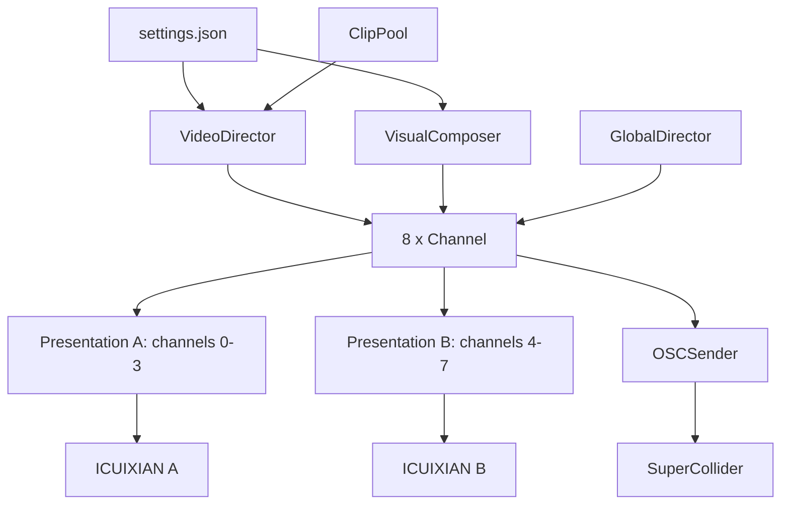

**Distribución física de los ocho canales:**

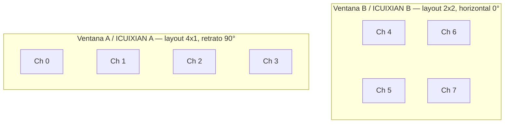

**Ventana A (canales 0–3):** cuatro tiras de retrato 1080×1920 px entregadas a ICUIXIAN A configurado como 4×1 con rotación de 90°. Cada panel recibe 480×1080 px del segmento correspondiente y lo escala y rota a formato vertical.

**Ventana B (canales 4–7):** mosaico 2×2 de pantallas horizontales 1920×1080 px entregado a ICUIXIAN B configurado como 2×2 sin rotación. Cada panel recibe un cuadrante de 960×540 px.

Anchura lógica total del sistema: 8640 px (8 × 1080). La resolución real por canal depende del modo de salida activo.

---

## Pipeline de visión artificial

Cada canal ejecuta un pipeline OpenCV independiente en cada fotograma. El vídeo se escala a la mitad de resolución para el análisis (FBO de 270×480 px), manteniendo la ruta de visualización en GPU a resolución completa (1080×1920 px).

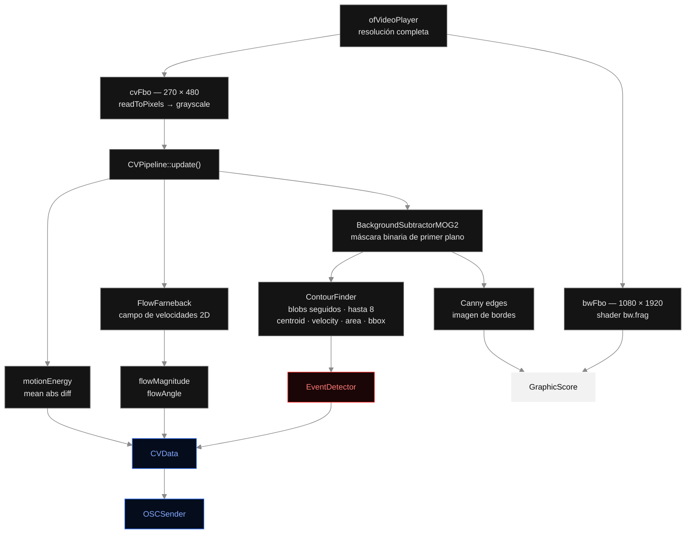

### Sustracción de fondo

`cv::BackgroundSubtractorMOG2` mantiene un modelo estadístico del fondo sobre una ventana histórica deslizante (por defecto 120 fotogramas). Cada nuevo fotograma se compara con ese modelo para generar una máscara binaria de primer plano que aísla los cuerpos en movimiento del campo estático.

### Flujo óptico

`ofxCv::FlowFarneback` opera sobre fotogramas en escala de grises consecutivos y produce un campo de velocidades 2D por píxel. Se extraen dos valores agregados:

- **Magnitud del flujo** — longitud media del vector, codifica intensidad global del movimiento.
- **Ángulo del flujo** — dirección media del vector, codifica dirección dominante.

### Detección de contornos y seguimiento de blobs

`ofxCv::ContourFinder` umbraliza la máscara de primer plano y encuentra contornos. Cada contorno es un blob seguido con posición normalizada (x, y), velocidad entre fotogramas (vx, vy), área, dimensiones del bounding box y etiqueta persistente. Se acumula también la **longitud total de contorno** como medida de la complejidad visual de la disposición de jugadores.

### Detección de bordes

Canny opera sobre el fotograma en escala de grises con umbrales bajo/alto configurables. La imagen resultante la usan directamente varios modos visuales (Barcode, VideoLines).

### Detección de eventos

`EventDetector` interpreta los datos de blobs en cuatro eventos de nivel superior:

| Evento | Lógica de detección |
|---|---|
| **Colisión** | IoU entre bounding boxes supera el umbral, o el recuento de blobs cae bruscamente |
| **Balón** | Blob menor que `ballMaxArea` px² cuya velocidad supera `ballMinSpeed` |
| **Multitud** | Al menos `crowdMinBlobs` blobs dentro del radio normalizado `crowdMaxDist` |
| **Distancia de piernas** | Elongación media de los blobs (bbH / √area), proxy de jugadores de pie |

---

## Técnicas visuales

La partitura gráfica cicla a través de 13 modos de renderizado secuenciados automáticamente. Cada modo dura un tiempo aleatorio entre `minModeDuration` y `maxModeDuration` segundos. Se inserta una pausa `BwClean` entre cada modo activo, enmarcando cada técnica como un episodio diferenciado.

`buildSequence()` recorre 19 modos activos por ciclo. Cada técnica entra desde el negro filmado y vuelve a él, de modo que la pausa es el eje de toda la partitura:

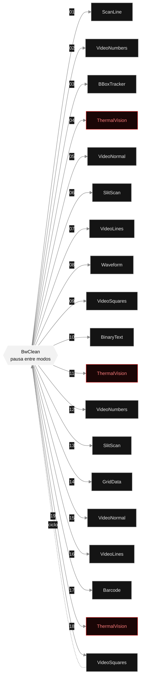

En rojo, las tres apariciones de `ThermalVision` — el estribillo más marcado del ciclo. `SlitScan`, `VideoLines`, `VideoNumbers`, `VideoNormal` y `VideoSquares` reaparecen dos veces cada uno; `BBoxTracker`, `Waveform`, `BinaryText`, `GridData` y `Barcode` suenan una sola vez por ciclo.

### Base fílmica — shader B&W (`bw.frag`)

Todos los modos que no usan color en bruto comienzan con este shader GLSL. Convierte el vídeo a escala de grises con coeficientes Rec.709 y aplica:

| Parámetro | Función |
|---|---|
| Gamma | Curva de gamma (por defecto 0,95) |
| Contraste / Brillo | Ajuste lineal alrededor del punto medio 0,5 |
| Curva S fílmica | Hermite smooth-step: levanta sombras, comprime altas luces |
| Viñeta elíptica | Oscurecimiento de bordes, más ancho horizontalmente |
| Grano animado | Hash noise jittered por el tiempo — patrón diferente cada fotograma |
| Posterización | Cuantiza luminancia a N pasos (256 = desactivado) |
| Umbral duro | Borde smooth-step para aspecto gráfico (0 = desactivado) |

### Modos de partitura

**BwClean** — base fílmica sin superposición. Pausa visual entre modos.

**ScanLine** — líneas horizontales cuya longitud se modula por `motionEnergy × sin(y, tiempo)`. Mira de cruz sobre el balón cuando se detecta.

**BBoxTracker** — bounding boxes con marcas de esquina (estética de cámara de vigilancia), etiquetas de blob ID, flechas de velocidad por centroide, círculo de balón.

**BinaryText** — posiciones y velocidades de blobs codificadas como cadenas binarias de 8 bits en texto denso. Barra de densidad de multitud en la parte inferior.

**Waveform** — histórico de `motionEnergy` como gráfico de barras horizontales (hasta 1920 muestras = ~64 s a 30 fps). Rastro de puntos en el borde derecho.

**GridData** — cuadrícula 32×48 de cruces cuya longitud de brazo se modula por `motionEnergy × sin(col, fila, tiempo)`. Centroides de blobs activos marcados con cruces mayores y coordenadas.

**Barcode** — máscara de primer plano comprimida en 64 barras verticales. Altura de barra = densidad media de primer plano por columna.

**VideoNormal** — vídeo en color en bruto, cover-cropped. Momento de contraste con la imagen directa.

**VideoSquares** — base B&W con hasta 6 parches de vídeo en color centrados en los blobs activos. Marcos con ticks de esquina y etiquetas de ID.

**VideoNumbers** — cuadrícula 36×64 de dígitos 0–9 mapeados al brillo de cada celda. Las celdas oscuras se omiten. Texto que también es imagen.

**VideoLines** — dibujo de líneas en tres capas:
1. *CLD* — filtrado bilateral + `ofxCv::CLD` (FDoG) extrae líneas interiores con calidad de lápiz.
2. *Siluetas FG* — contornos de la máscara cerrados morfológicamente, aproximados con `approxPolyDP`, suavizados (`getSmoothed(9)`) y redibujados en tres pasadas: halo ancho · brillo medio · tinta nítida.
3. *Trazos de flujo* — vectores Farneback como segmentos de línea dirigidos sobre una cuadrícula.

**ThermalVision** — mapa de colores Ironbow / FLIR via `thermal.frag`: negro (frío) → violeta → carmesí → naranja → amarillo → blanco (caliente). Artefacto de cuadrícula de sensor animada. Barra de gradiente en borde derecho. Marcas térmicas por blob.

**SlitScan** — slit-scan temporal. La columna central del fotograma en escala de grises se escribe en un buffer circular de 270 columnas. El buffer se despliega izquierda (pasado) → derecha (presente). Eje de tiempo etiquetado en segundos en la parte inferior.

**Flash** — rectángulo blanco de pantalla completa que se desvanece de alpha 200 a 0 en `flashDuration` (0,25 s). Se activa automáticamente en colisiones detectadas.

### Elementos visuales persistentes

**Ciclo de color de marcas** — en cada transición de modo el color avanza: blanco → rojo → azul eléctrico → repetir.

**Strobe de clip** — en cada cambio de clip un rectángulo blanco o rojo se desvanece a 1100 alpha/s (~0,23 s).

**HUD de datos** — siempre visible sobre cualquier modo: barra de energía vertical (2 px) en el borde izquierdo, contador de fotogramas y recuento de blobs en la esquina inferior izquierda, mira de cruz sobre el balón cuando se detecta.

---

## Nube de puntos de vídeo por GPU

`VideoPointCloudGenerator` convierte en tiempo real el fotograma de vídeo de cada canal en una nube de puntos tridimensional renderizada íntegramente en GPU sin lectura de píxeles hacia CPU.

### Principio de funcionamiento

Una cuadrícula UV estática de 256×256 (65 536 puntos por canal) se instancia en el vertex shader, que muestrea directamente la textura del `ofVideoPlayer` activo. La profundidad Z se deduce de la luminancia del píxel muestreado (modo `Luminance`), de una máscara PDJV cuando está disponible (modo `PdjvMask`), o de la combinación de ambos (modo `Hybrid`). No hay lectura GPU→CPU por fotograma ni actualizaciones del VBO.

Cada canal mantiene cámara independiente y buffer de retroalimentación opcional. Los dos grupos de presentación (canales 0–3 en ventana A, canales 4–7 en ventana B) conservan el orden ICUIXIAN.

### Integración PDJV

Cuando se proporciona un paquete `.pdjv` en `videoPointCloud.pdjvPackagePath`, el runtime carga máscaras y profundidades por jugador. Si el paquete no está disponible o no corresponde al clip activo, el sistema cae en modo `Luminance` sin interrumpir la reproducción.

### Presets disponibles

| Preset | Índice | Descripción |
|---|---|---|
| Luminance Relief | 0 | Relieve de luminancia — puntos blancos con profundidad derivada del brillo |
| Player Extraction | 1 | Extracción de jugadores — puntos coloreados con máscara PDJV |
| Hybrid Stadium Field | 2 | Campo de estadio híbrido — luminancia para el campo, máscara para los cuerpos |

### Configuración en `settings.json`

```jsonc
"videoPointCloud": {
    "enabled": true,
    "qualityTier": "Installation",  // "Draft" | "Preview" | "Installation"
    "gridWidth": 256,
    "gridHeight": 256,
    "depthSource": "Luminance",     // "Luminance" | "PdjvMask" | "Hybrid"
    "maskMode": "FullFrame",
    "depthScale": 1.15,
    "depthCenter": 0.5,
    "pointSize": 2.2,
    "luminanceFloor": 0.035,
    "luminanceCeiling": 1.0,
    "colorGain": 1.0,
    "opacity": 0.9,
    "zInvert": false,
    "feedbackEnabled": false,
    "feedbackDecay": 0.88,
    "autoFit": true,
    "cameraDistance": 1.8,
    "cameraFov": 42,
    "transitionDisplacement": 0.85,
    "preset": 0,
    "pdjvPackagePath": ""
}
```

Un canal puede anular claves individuales bajo `channels[N].videoPointCloud`. Los valores no especificados se heredan de la sección global.

### Control OSC

| Dirección | Efecto |
|---|---|
| `/pdjv/vpc/<parámetro>` | Ajuste global del parámetro en todos los canales |
| `/pdjv/channel/<N>/vpc/<parámetro>` | Ajuste por canal |
| `/pdjv/vpc/reset` | Limpia el historial de retroalimentación (todos los canales) |
| `/pdjv/channel/<N>/vpc/reset` | Limpia el historial de retroalimentación del canal N |

---

### Lenguaje visual procedimental

`VisualGenerator` añade ocho escenas sintéticas que pueden ocupar la pantalla sin vídeo o transformar el último fotograma capturado:

- **RasterPulse:** bandas, obturadores, bloques de prueba e inversiones cuantizadas.
- **BitMatrix:** celdas binarias derivadas de movimiento y blobs.
- **ModularGrid:** retículas, subdivisiones y ocupación variable.
- **PhaseLines:** Lissajous, interferencia y sistemas de líneas pulsantes.
- **VectorField:** vectores derivados del flujo óptico que persisten después del vídeo.
- **DataLedger:** coordenadas, metadatos, contadores y matrices numéricas.
- **SignalTrace:** históricos de señal y rastrogramas.
- **ThresholdBridge:** rasterización y disolución del vídeo hacia una escena sintética.

La paleta mantiene negro/blanco con acentos rojos y azul eléctrico. La variación se calcula a partir de semilla, tiempo y datos; no usa aleatoriedad nueva en cada fotograma.

#### Gramática para ocho pantallas

`OrganizationMode` separa la escena visual de su distribución espacial:

1. **Unison:** una regla común en los ocho canales, con variaciones mínimas.
2. **Propagation:** el evento viaja por los canales mediante retardos ordenados.
3. **Counterpoint:** cada canal asume un rol: cuerpo, trayectoria, velocidad, relaciones, densidad, campo, predicción o metadatos.
4. **4 + 4:** canales 0–3 observan archivo/presente/cuerpos/movimiento; canales 4–7 interpretan datos/posibilidad/relaciones/predicción.

Cada capítulo generativo recorre **Appearance → Development → Threshold → Transformation → Dissolution**. Las etapas no tienen igual duración: Appearance y Development protegen la legibilidad de la regla; Transformation transfiere retícula, fase, trayectoria, ritmo o máscara al capítulo siguiente; Dissolution puede decaer o terminar con un corte preciso.

`VisualComposer` trabaja en tres escalas: capítulo, frase y arco. Sus elecciones ponderadas excluyen repeticiones recientes y respetan duraciones mínimas. Los estados `Breath` introducen negro, quietud o marcas escasas para evitar actividad constante. El compositor está desactivado por defecto en `settings.json`.

En modo de ocho canales, `cv.eightChannelEveryNFrames` escalona el análisis CV entre canales y los capítulos sintéticos suspenden decodificación/readback. La vista Overview muestra el coste `Update` en milisegundos por canal para verificar el presupuesto de 30 fps.

---

## Elementos compositivos

### La secuencia como partitura

La secuencia en `buildSequence()` prescribe un orden fijo de técnicas separadas por pausas `BwClean`. Como cada modo dura un tiempo aleatorio, la secuencia es indeterminada en duración pero determinada en orden. `ThermalVision` aparece tres veces, `SlitScan` y `VideoLines` dos veces cada una. Las repeticiones funcionan como estribillos.

### El GlobalDirector

`GlobalDirector` aplica manipulación temporal a todos los canales simultáneamente. Tres procesos independientes en máquina de estados propia:

**Proceso temporal** — cámara lenta y avance rápido comparten el estado `Idle`, por lo que son mutuamente excluyentes:

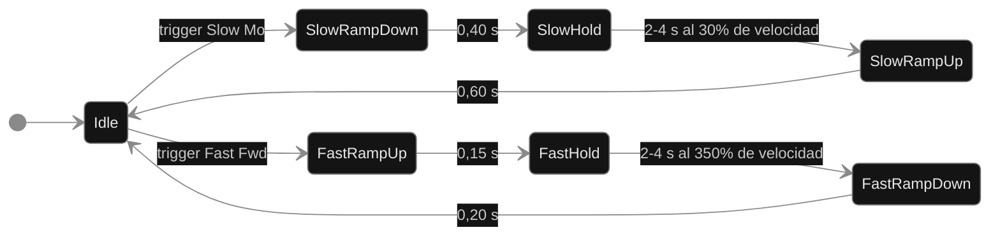

**Proceso de borrado** — independiente del temporal, puede solaparse con él:

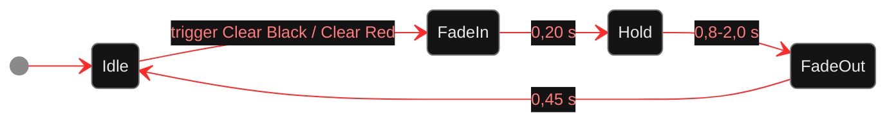

Todos los ramps usan ease Hermite: `t² × (3 − 2t)`.

| Parámetro | Valor por defecto |
|---|---|
| Velocidad lenta | 30% de la velocidad base |
| Velocidad rápida | 350% de la velocidad base |
| Auto-disparo | Desactivado por defecto (control manual desde la ControlApp) |
| Paleta de borrado | rojo vivo → negro → flash blanco → negro → carmesí → negro (ciclo) |

Los disparadores manuales (Slow Mo, Fast Fwd, Clear Black, Clear Red) están disponibles en todo momento desde la ControlApp. Los auto-disparadores se habilitan por separado (`autoSlow`, `autoFast`, `autoClear`).

**Sincronización entre ventanas:** ambas ventanas de presentación comparten el mismo `GlobalDirector`, `VideoDirector` y `VisualComposer`. Los guards por número de fotograma evitan que dos apps de ventana avancen el tiempo global dos veces.

### Director de Vídeo (VideoDirector)

`VideoDirector` es el director cinematográfico del material de archivo. Gestiona qué clip se reproduce en cada canal, desde qué punto y durante cuánto tiempo, introduciendo además **eventos compartidos** donde todos los canales activos reproducen el mismo fragmento simultáneamente.

`VideoDirector::update()` se llama cada fotograma y alterna entre dos regímenes: programación independiente por canal y, periódicamente, el evento compartido con su protocolo de arranque sincronizado.


**Tipos de plan:**

| Tipo | Duración | Peso por defecto |
|---|---|---|
| `ShortFragment` | 8–25 s | 50% |
| `LongFragment` | 30–120 s | 30% |
| `FullVideo` | duración completa del clip | 20% |

Cada plan incluye una `startFraction` aleatoria (punto de inicio normalizado 0–1 dentro del clip) y un `revision` entero que permite al canal detectar si recibió un plan actualizado.

El canal implementa la lógica de reproducción del plan: busca el punto de inicio correcto, configura el segmento con `segmentStartSeconds_` / `segmentEndSeconds_`, y llama a `reportFinished()` cuando el segmento termina. Para el evento compartido, además llama a `reportReady()` una vez que el clip está cargado y el punto de inicio calculado, de modo que el `VideoDirector` puede coordinar el arranque simultáneo.

### Pool de Clips (ClipPool)

`ClipPool` gestiona el acceso al inventario de clips con dos estrategias distintas:

**Clips independientes** (`getIndependentClip`):
- Evita clips activos en otros canales en ese momento.
- Mantiene un historial deslizante de 3 clips por canal para evitar repetición inmediata.
- Relaja las restricciones en cascada si el pool es pequeño: historial → exclusividad entre canales → cualquier clip.

**Clip compartido** (`getSharedClip`):
- Mantiene su propio historial deslizante de 3 clips para el evento compartido.
- Elige entre todos los clips no utilizados recientemente en eventos compartidos.

### Ocho canales en dos ventanas

Un proceso ejecuta ocho pipelines. `ClipPool`, `VideoDirector`, `GlobalDirector` y `VisualComposer` son compartidos por todos los canales, de modo que la programación, el reloj y los eventos colectivos permanecen coordinados.

El `GlobalDirector` sincroniza la sensación temporal y el `VisualComposer` organiza capítulos en unísono, propagación, contrapunto o grupos 4 + 4.

Distribución de monitores:
- Ventana A / ICUIXIAN A → canales 0–3 (layout 4×1, retrato 90°)
- Ventana B / ICUIXIAN B → canales 4–7 (layout 2×2, horizontal 0°)
- Cada enlace ordenador → controlador usa 1920×1080 a 60 Hz.

### Transmisión de datos OSC

El proceso transmite cuatro bundles UDP pequeños por canal y fotograma (~30 fps): core, blobs, contexto y generador. Las direcciones son únicas de `/pdj/channel/0` a `/pdj/channel/7`.

**Bundle core** — un mensaje por valor escalar:

| Dirección | Tipo | Contenido |
|---|---|---|
| `.../state/frame` | int | contador monotónico — detecta paquetes perdidos |
| `.../state/time` | float | segundos transcurridos oF |
| `.../flow/magnitude` | float | longitud media del vector Farneback |
| `.../flow/angle` | float | dirección media del vector (radianes) |
| `.../motion/energy` | float | diferencia absoluta media entre fotogramas, 0–1 |
| `.../blobs/count` | int | número de contornos activos |
| `.../contour/length` | float | perímetro total de contornos (px, resolución de análisis) |
| `.../event/collision` | int | 0 ó 1 |
| `.../event/ball` | int | 0 ó 1 |
| `.../event/ball/x` | float | x normalizada del balón, 0–1 |
| `.../event/ball/y` | float | y normalizada del balón, 0–1 |
| `.../event/crowd` | float | densidad de multitud, 0–1 |
| `.../event/leg_distance` | float | elongación media de blobs, 0–1 |

**Bundle de blobs** — siempre 8 mensajes (uno por slot); slots inactivos llevan ceros:

| Dirección | Args (en orden) |
|---|---|
| `.../blob/{0-7}/state` | active(int) x y vx vy area bbW bbH (todos float, normalizados) |

**Bundle de contexto** — reenviado cada fotograma para recuperar paquetes perdidos:

| Dirección | Tipo | Contenido |
|---|---|---|
| `.../video/name` | string | nombre del clip activo |
| `.../video/position` | float | posición de reproducción, 0–1 |
| `.../video/duration` | float | duración del clip en segundos |
| `.../video/revision` | int | se incrementa en cada cambio de clip |
| `.../score/mode` | int | modo visual activo 0–13 |
| `.../score/revision` | int | se incrementa en cada transición de modo |
| `.../director/temporal` | int | `TemporalPhase`: 0=Idle 1=SlowRampDown 2=SlowHold 3=SlowRampUp 4=FastRampUp 5=FastHold 6=FastRampDown |
| `.../director/speed` | float | multiplicador de velocidad actual |
| `.../director/clear` | int | `ClearPhase`: 0=Idle 1=FadeIn 2=Hold 3=FadeOut |
| `.../director/clear_alpha` | float | opacidad del borrado, 0–1 |
| `.../generator/active` | int | 1 durante Generator o Transition |
| `.../generator/mode` | int | escena 0–7 |
| `.../generator/revision` | int | revisión de capítulo |
| `.../generator/organization` | int | Unison, Propagation, Counterpoint o 4 + 4 |
| `.../generator/role` | int | rol analítico del canal 0–7 |
| `.../generator/stage` | int | etapa temporal 0–4 |
| `.../generator/stage_progress` | float | progreso interno de etapa, 0–1 |
| `.../generator/beat_phase` | float | fase del pulso compartido, 0–1 |
| `.../generator/beat_index` | int | contador de pulsos |
| `.../generator/envelope` | float | envolvente narrativa, 0–1 |
| `.../generator/seed` | int | semilla reproducible del capítulo |
| `.../generator/transition` | int | 1 durante ThresholdBridge |

### Motor de audio SuperCollider

El motor comprende los siguientes archivos en `supercollider/`:

| Archivo | Función |
|---|---|
| **`pdj_launcher.scd`** | Punto de entrada para el paquete de distribución. Encadena automáticamente `pdj_audio_config.scd` y `pdj_datamatics.scd`, imprime un informe de configuración completo y lanza un monitor de salud periódico (cada 2 minutos). Lanzado por `Start Audio.command`. |
| **`pdj_audio_config.scd`** | Detección automática de Dante Virtual Soundcard. DANTE presente → 8 canales de salida a 48 kHz; DANTE ausente → rescate estéreo en dispositivo por defecto. Reinicia el servidor con las opciones correctas. Evaluar antes de `pdj_datamatics.scd`. |
| **`pdj_datamatics.scd`** | Motor principal: infraestructura de buses, SynthDefs de infraestructura, conductor de datos (4 Hz), secuenciador binario en cuadrícula (0,42 s/paso), manejadores OSC y vigilancia de telemetría. Lee `~numSpeakers` definida por `pdj_audio_config.scd`. |
| **`pdj_mode_voices.scd`** | Voces escénicas específicas por modo: un SynthDef por cada uno de los 13 modos del ScoreMode, más `pdjKick`. Cargado automáticamente por `pdj_datamatics.scd`. |
| **`pdj_volumetric_compat.scd`** | Capa de compatibilidad OSC para el runtime volumétrico. Registra manejadores `/pdjv/channel/N/...` que mapean mensajes del runtime volumétrico a los buses de control del motor de audio. Permite que audio y runtime volumétrico coexistan en la misma red. |
| **`data_matrix_functional_study.scd`** | Estudio funcional de referencia basado en el análisis del archivo `19 data.matrix.flac`. No forma parte del motor de instalación; sirve como vocabulario de partida y banco de pruebas de síntesis. |

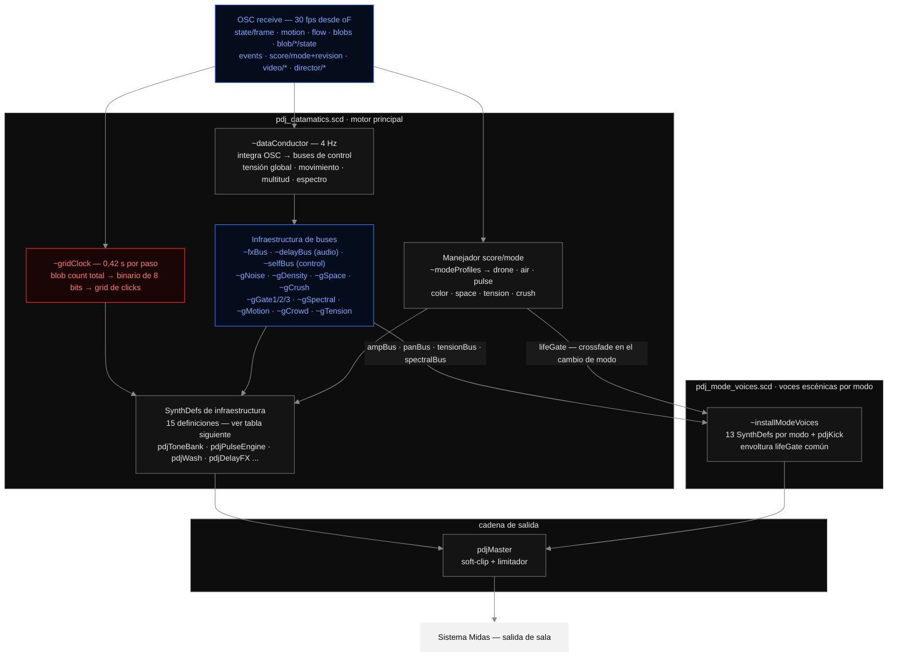

**Voces específicas por modo (`pdj_mode_voices.scd`):**

Cada modo visual tiene su propio SynthDef con una identidad sonora coherente con la imagen. Todos comparten la misma envoltura de vida (`lifeGate`) para crossfades suaves en el cambio de modo, y todos leen los mismos buses de control (`ampBus`, `panBus`, `tensionBus`, `spectralBus`). La función de síntesis recibe como argumentos `base` (frecuencia fundamental del canal), `anchor` (ancla espectral compartida), `tension`, `activity`, `color`, `variant` y `evo` (evolución temporal 0–1).

| SynthDef | Carácter sonoro |
|---|---|
| `pdjModeBwClean` | Drone de senos puro con noise marrón filtrado a baja densidad |
| `pdjModeScanLine` | Senos fijos + noise rosa con centro espectral que barre lentamente |
| `pdjModeBBoxTracker` | Parciales superiores impares + noise rosa centrado en el ancla |
| `pdjModeBinaryText` | Senos con step LFNoise0 + pulso LP (cadencia de datos binarios) |
| `pdjModeWaveform` | Drone ondulatorio de tres parciales + noise marrón que respira |
| `pdjModeGridData` | Drone base + Ringz multi-parcial activado por Dust |
| `pdjModeBarcode` | Senos bajos + noise gris en tres centros filtrados + CombL |
| `pdjModeVideoNormal` | Drone cálido de cuatro parciales + noise marrón armónico |
| `pdjModeVideoSquares` | Seno base + cuatro BPFs en torno al ancla que derivan lentamente |
| `pdjModeVideoNumbers` | Senos cuya razón sigue un dígito LFNoise0 + BPF proporcional |
| `pdjModeVideoLines` | Senos de borde + tres BPFs de noise rosa (silueta → línea → haz) |
| `pdjModeThermal` | Tríada de senos sub-temperatura + noise marrón LP que asciende |
| `pdjModeSlitScan` | Drone + BPF + CombL con retardo largo (tiempo comprimido en eco) |
| `pdjModeFlash` | Seno fundamental + 16.º parcial + BPF en el ancla × 3,5 |

`pdjKick` — golpe grave cinematográfico (body sinusoidal con pitch sweep + edge de noise rosa) usado por el secuenciador de cuadrícula y eventos de colisión de alta energía.

**SynthDefs de infraestructura:**

| SynthDef | Función |
|---|---|
| `pdjToneBank` | Cuatro familias de drone (abismo/cine, barrido/vigilancia, datos/cristal, temporal/niebla); voz activa seleccionada por el modo visual |
| `pdjPulseEngine` | Continuo click → ritmo → pitch → ruido: un tren de Impulse cuya tasa impulsa el CV en vivo |
| `pdjNoiseBed` | Noise de banda de paso por canal siguiendo el ancla espectral compartida |
| `pdjSpectralAnchor` | Frecuencia central de deriva lenta compartida por `pdjWash` y `pdjNoiseBed` |
| `pdjWash` | Portador ambiente principal |
| `pdjCrackle` | Grano escaso activado por Dust |
| `pdjSub` | Presión sinusoidal baja siguiendo densidad de multitud |
| `pdjClick` | Click corto de barrido estéreo para colisión/balón |
| `pdjGlitch` | Ráfaga de glitch digital para cortes de modo |
| `pdjImpact` | Onda de presión cinematográfica baja para colisiones |
| `pdjTrace` | Arco espacial corto para detección de balón |
| `pdjClearSweep` | Elevación espectral difusa en evento de borrado |
| `pdjDelayFX` | Reflexiones tempranas + reverberación algorítmica |
| `pdjSelfAnalysis` | Retroalimentación meta: lee amplitud del master a un bus de control |
| `pdjMaster` | Soft-clip + limitador en la salida |

**Mapeo de escena visual:** cada modo selecciona un perfil `~modeProfiles` con valores de `drone`, `air`, `pulse`, `color`, `space`, `tension` y `crush`. El `~dataConductor` integra el CV a 4 Hz, calcula tensión global y espectro objetivo, y actualiza todos los buses. El estado del director (lento/rápido/clear) transforma la voz: lento → haze temporal; rápido → datos/cristal.

**Secuenciador binario:** cada 0,42 s, la suma de blobs en todos los canales se lee como número binario de 8 bits. Cada bit activo dispara un click en esa posición de cuadrícula a un pitch que codifica el índice del bit (1800–8100 Hz).

**Vigilancia de telemetría:** un canal cuyo paquete `state/frame` no llega en 1 s se marca como offline con aviso en consola.

El motor está configurado para `~numChannels = 8` y ocho frecuencias base en `~channelBases`.

---

## Interfaz de control (ControlApp)

La ControlApp es una ventana ImGui independiente accesible con la tecla `U`. Está organizada en tres pestañas.

### Vista general

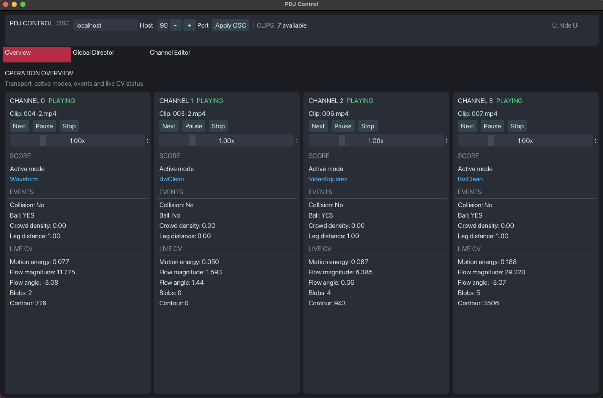

La pestaña **Overview** muestra el estado operativo de los ocho canales simultáneamente. Cada columna presenta transporte (clip activo, Next / Pause / Stop, velocidad), modo visual activo, estado en vivo de los cuatro detectores de eventos (Collision, Ball, Crowd density, Leg distance) y telemetría CV cuadro a cuadro (Motion energy, Flow magnitude, Flow angle, Blobs, Contour). La barra superior expone la configuración OSC y el total de clips disponibles. La tecla `U` oculta toda la interfaz para la presentación.

---

### Director Global

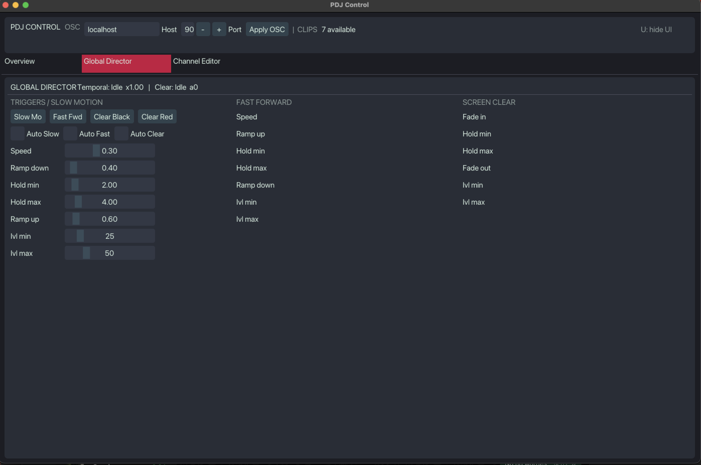

La pestaña **Global Director** centraliza el control temporal de todos los canales. La línea de estado muestra la fase temporal activa, el multiplicador de velocidad y el estado del borrado.

**Disparadores manuales:**

| Botón | Acción |
|---|---|
| Slow Mo | Inicia cámara lenta en todos los canales |
| Fast Fwd | Inicia avance rápido en todos los canales |
| Clear Black | Borrado de pantalla en negro |
| Clear Red | Borrado de pantalla en rojo |

Los toggles **Auto Slow**, **Auto Fast** y **Auto Clear** habilitan el disparado automático de cada proceso. Por defecto están desactivados para que el intérprete decida cuándo actuar.

Los tres bloques de parámetros (Slow Motion, Fast Forward, Screen Clear) ajustan velocidades objetivo, duraciones de rampa y retención, e intervalos de auto-disparo en segundos.

---

### Editor de canal

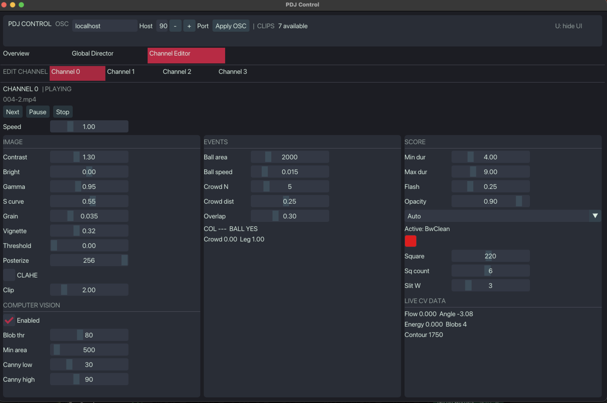

La pestaña **Channel Editor** permite editar en detalle cualquiera de los ocho canales. Cuatro bloques de parámetros:

**IMAGE** — controla el shader B&W:

| Parámetro | Efecto |
|---|---|
| Contrast / Bright | Ajuste lineal de contraste y brillo |
| Gamma | Curva de gamma |
| S curve | Intensidad de la curva S fílmica |
| Grain | Amplitud del grano analógico animado |
| Vignette | Intensidad del oscurecimiento elíptico |
| Threshold | Umbral duro B&W (0 = desactivado) |
| Posterize | Cuantización de niveles (256 = desactivado) |
| CLAHE / Clip | Mejora de contraste adaptativa local |

**COMPUTER VISION** — pipeline OpenCV:

| Parámetro | Efecto |
|---|---|
| Enabled | Activa / desactiva el análisis CV del canal |
| Blob thr | Umbral de binarización para contornos |
| Min area | Área mínima en px² para blobs válidos |
| Canny low / high | Umbrales del detector de bordes Canny |

**EVENTS** — sensibilidad de detectores:

| Parámetro | Efecto |
|---|---|
| Ball area | Área máxima en px² para considerar blob como balón |
| Ball speed | Velocidad mínima normalizada para confirmar balón |
| Crowd N | Blobs mínimos para evento de multitud |
| Crowd dist | Radio normalizado de agrupación |
| Overlap | Umbral IoU para colisión |

**SCORE** — director de partitura gráfica:

| Parámetro | Efecto |
|---|---|
| Min dur / Max dur | Rango aleatorio de duración de modo en segundos |
| Flash | Duración del flash blanco en colisión |
| Opacity | Opacidad global de las marcas |
| Mode (dropdown) | Fuerza un modo fijo o deja Auto para la secuencia automática |
| Active | Modo activo en este instante |
| Square / Sq count | Tamaño y número máximo de parches en VideoSquares |
| Slit W | Anchura de la franja en SlitScan |

La sección **LIVE CV DATA** muestra flujo, ángulo, energía, blobs y contorno en tiempo real.

---

## Dependencias

**Runtime de instalación principal (`src/`):**

| Biblioteca | Función |
|---|---|
| openFrameworks 0.12.0 | gráficos, reproducción de vídeo, gestión de ventanas |
| ofxOpenCv | wrapper de OpenCV para openFrameworks |
| ofxCv | utilidades CV de alto nivel (CLD, Farneback, ContourFinder) |
| ofxOsc | envío/recepción OSC |
| ofxImGui | panel de control basado en ImGui |
| OpenCV | sustracción de fondo (MOG2), bordes, flujo óptico |
| SuperCollider | motor de síntesis de audio |
| Dante Virtual Soundcard | dispositivo de audio virtual para la red DANTE (instalación) |
| Dante Controller | enrutamiento de canales en la red DANTE (instalación) |
| Syphon | (incluido) compartición de texturas GPU |
| FMOD | (incluido) |

**Analizador fuera de línea (`analyzer/`):**

| Paquete | Función |
|---|---|
| Python 3.12+ | entorno de ejecución |
| numpy, opencv-python | procesamiento de imagen y vídeo |
| Ver `analyzer/requirements.txt` | lista completa de dependencias |

**Runtime volumétrico (`volumetric/`):**

| Biblioteca | Función |
|---|---|
| openFrameworks 0.12.0 | gráficos y ventanas |
| ofxOsc | OSC de control |
| ofxImGui | panel de control |

---

## Configuración

Todos los parámetros en tiempo de ejecución están en `bin/data/settings.json`. En instalación, el sistema guarda además una copia de usuario en `~/Library/Application Support/PartituraDelJuego/settings.json` que prevalece sobre la del bundle.

```jsonc
{
    // Modo de salida activo
    "outputMode": "dualWindow8",      // "dualWindow8" | "singleWindow"
    "presentationFullscreen": true,

    // Posiciones de las dos ventanas de presentación
    "presentationWindows": [
        { "x": 0,    "y": 0, "width": 1920, "height": 1080, "layout": "4x1" },
        { "x": 1920, "y": 0, "width": 1920, "height": 1080, "layout": "2x2" }
    ],

    // Ventana de control
    "controlWindow": { "x": 30, "y": 40, "width": 1400, "height": 900 },

    // Clips de vídeo
    "clips": {
        "folder": "../../cortos",        // clips en retrato (canales 0–3)
        "horizontalFolder": "horizontal" // clips horizontales (canales 4–7)
    },

    "targetFPS": 30,

    // Transmisión OSC
    "osc": { "host": "localhost", "port": 9001, "listenPort": 9002 },

    // Visión artificial
    "cv": {
        "halfRes": true,
        "analysisEveryNFrames": 1,
        "eightChannelEveryNFrames": 2,  // escalona el análisis entre canales en modo 8ch
        "flowWindowSize": 6,
        "blobMinArea": 500,
        "blobMaxArea": 200000,
        "bgSubHistory": 120,
        "bgSubThreshold": 25.0
    },

    // Planificación cinematográfica de vídeo
    "videoDirector": {
        "enabled": true,
        "shortWeight": 0.50,   // probabilidad de fragmento corto
        "longWeight":  0.30,   // probabilidad de fragmento largo
        "fullWeight":  0.20,   // probabilidad de vídeo completo
        "shortMin": 8,  "shortMax": 25,    // segundos
        "longMin": 30,  "longMax": 120,
        "sharedIntervalMin": 120, "sharedIntervalMax": 300,  // evento compartido
        "sharedStartDelay": 0.35,
        "driftTolerance": 0.08
    },

    // Compositor visual
    "visualComposer": {
        "enabled": true,
        "seed": 0,             // 0 = semilla aleatoria por sesión; != 0 = reproducible
        "bpm": 90.0,
        "generatorProbability": 0.35,
        "videoProbability": 0.45,
        "organizationWeights": [0.2, 0.3, 0.35, 0.15],  // Unison, Propagation, Counterpoint, 4+4
        "disabledGenerators": [11, 14]                   // lista de generadores excluidos del programa
    },

    // Nube de puntos de vídeo por GPU
    "videoPointCloud": {
        "enabled": true,
        "qualityTier": "Installation",
        "gridWidth": 256, "gridHeight": 256,
        "depthSource": "Luminance",
        "pointSize": 2.2,
        "feedbackEnabled": false,
        "preset": 0,
        "pdjvPackagePath": ""   // dejar vacío si no hay paquete PDJV
    },

    // Configuración de los controladores ICUIXIAN
    "videoWallController": {
        "brand": "ICUIXIAN", "model": "0104-XZ", "asin": "B0DM98NVSH",
        "controllers": 2,
        "inputWidth": 1920, "inputHeight": 1080, "refreshHz": 60.0,
        "wallA": { "layout": "4x1", "panelOrientation": "portrait",   "rotationDegrees": 90 },
        "wallB": { "layout": "2x2", "panelOrientation": "landscape",  "rotationDegrees": 0  }
    },

    // Prueba de rendimiento
    "performanceTest": {
        "durationSeconds": 600.0,
        "thresholds": {
            "minimumFps": 29.0,
            "p95FrameMs": 38.0,
            "maximumLatePercent": 0.5,
            "stallFrameMs": 100.0,
            "maximumMemoryGrowthMB": 256.0
        }
    }
}
```

**Layouts de ventana predefinidos (intercambiables en `settings.json`):**

| Clave | Uso |
|---|---|
| `presentationWindows` (activo) | Dos escritorios ICUIXIAN, 1920×1080 cada uno |
| `_testLayout` | Desarrollo — 4 ventanas pequeñas (270×480) en pantalla integrada |
| `_testSingleWindow` | Prueba en portátil — ventana única 1920×1080 con 4 segmentos |
| `_installationLayout` | 4 ventanas verticales 1080×1920 para configuración legacy |
| `singleWindow` | Modo de una ventana: 3840×2160 para cuatro canales lado a lado |

La ControlApp (tecla `U`) da acceso en vivo a vídeo, compositor, nube de puntos, organización espacial y parámetros por canal sin recompilar.

---

## Ejecución

### Desarrollo (una máquina, ventanas de prueba)

```bash
# Editar settings.json: sustituir el array "channels" por _testLayout
# para obtener ventanas pequeñas en la pantalla integrada
make && bin/Partitura_del_Juego
```

**Audio en desarrollo — IDE de SuperCollider:**

```supercollider
// 1. Evaluar pdj_audio_config.scd primero (seleccionar todo -> Cmd+Return).
//    Esperar "Server ready" en Post Window.
// 2. Evaluar pdj_datamatics.scd (seleccionar todo -> Cmd+Return).
//    Esperar "PDJ Datamatics — listening OSC UDP :9001".
// NO presionar Boot Server (Cmd+B) manualmente;
// pdj_audio_config.scd arranca el servidor con el dispositivo correcto.

// Flujo de audio sintético sin oF:
~testOsc.play;

// Apagar audio:
~shutdown.();
```

### Paquete de distribución (macOS arm64)

El paquete distribuible se construye con:

```bash
scripts/package_macos_arm64.sh
# Genera dist/Partitura_del_Juego-macOS-arm64.zip
```

El paquete incluye la aplicación firmada ad-hoc, la biblioteca de 48 clips, los shaders y los archivos de SuperCollider con los scripts `Start Audio.command` y `Check Audio.command` listos para doble clic. Ver `distribution/README-macOS.md` para instrucciones de distribución y prueba.

### Instalación completa (una máquina, 8 canales)

```bash
# settings.json activo:
#   outputMode: "dualWindow8"
#   presentationWindows: dos escritorios a 1920x1080
#   osc.host: localhost
make && bin/Partitura_del_Juego
```

**Audio en instalación — script de arranque:**

```bash
# Doble clic en Start Audio.command (en el paquete distribuido)
# o en el IDE:
#   1. Activar Dante Virtual Soundcard (TX=8, RX=2, 48 kHz, latencia 1 ms)
#   2. Evaluar pdj_audio_config.scd
#   3. Evaluar pdj_datamatics.scd
```

El script `Start Audio.command` ejecuta `pdj_launcher.scd`, que encadena automáticamente `pdj_audio_config.scd` y `pdj_datamatics.scd` en el orden correcto. Imprime un informe de configuración completo incluyendo modo DANTE, dispositivo, canales, tasa de muestreo y posiciones de bocinas. Deja la ventana de terminal abierta durante toda la instalación; cada dos minutos imprime una línea de salud del servidor.

El script `Check Audio.command` escanea el sistema sin arrancar el motor: detecta DANTE, lista dispositivos de audio y verifica conectividad de red. Usar antes de cada sesión para diagnosticar la configuración DANTE.

**Orden de arranque:** multicontactos → pantallas → unidades ICUIXIAN → ordenador → SuperCollider (script o IDE) → aplicación. Apagado en orden inverso; detener SuperCollider siempre con `~shutdown.()` antes de deshabilitar Dante Virtual Soundcard.

#### Ajuste de los controladores ICUIXIAN

La configuración usa dos unidades ICUIXIAN `0104-XZ` (ASIN `B0DM98NVSH`) con disposición mixta:

**Controlador A — muro de retratos (Ventana A, canales 0–3):**

1. Conectar la primera salida del Mac a `HDMI IN` de la unidad A.
2. Conectar `HDMI OUT 1–4` a los cuatro paneles en retrato, de izquierda a derecha.
3. Seleccionar mosaico `4×1` y rotación `90°`. Si los paneles quedan invertidos, usar `270°`.

**Controlador B — muro horizontal (Ventana B, canales 4–7):**

1. Conectar la segunda salida del Mac a `HDMI IN` de la unidad B.
2. Conectar `HDMI OUT 1–4` a los cuatro paneles horizontales en el orden del mosaico: fila superior izquierda (OUT 1), fila superior derecha (OUT 2), fila inferior izquierda (OUT 3), fila inferior derecha (OUT 4).
3. Seleccionar mosaico `2×2` y rotación `0°`.

**Pasos comunes a ambas unidades:**

4. Desactivar el mirroring de macOS y usar escritorio extendido (dos escritorios externos a 1920×1080 a 60 Hz).
5. En la ControlApp pulsar **Configure Mixed Wall (Wall A + B)** para detectar automáticamente ambas salidas y guardar sus posiciones en `presentationWindows`. Reiniciar la aplicación.

La ficha técnica limita los modos de mosaico con rotación a entrada 1920×1080; 3840×2160 a 30 Hz sólo es válido para modos sin esa rotación. El botón rechaza configuraciones donde macOS no exponga 1080p60 en ambos controladores.

El archivo `bin/data/settings.json` refleja la disposición activa en `videoWallController`:

```json
"videoWallController": {
    "wallA": { "layout": "4x1", "panelOrientation": "portrait",   "rotationDegrees": 90 },
    "wallB": { "layout": "2x2", "panelOrientation": "landscape",  "rotationDegrees": 0  }
}
```

#### Prueba de rendimiento

La página **Performance** de la ControlApp ejecuta una prueba reproducible de
10 minutos sobre las dos ventanas y los ocho canales. Tras 10 segundos de
calentamiento recorre vídeo normal, `VideoLines`, `VideoNumbers`, `SlitScan`
con cambios de clip y los ocho generadores. Al terminar restaura los modos
forzados y la activación original del compositor.

La prueba mide FPS y percentiles de tiempo de cuadro por ventana, tiempo GPU
sin bloquear el render, decodificación, render de vídeo, lectura GPU→CPU,
OpenCV, composición, OSC, uso de CPU y memoria residente. El resultado pasa
cuando ambas ventanas mantienen al menos 29 FPS, p95 inferior a 38 ms, menos
de 0.5% de cuadros por encima de 50 ms, ningún atasco superior a 100 ms y
crecimiento de memoria inferior a 256 MB.

Los botones **Start**, **Stop**, **Reset** y **Export report** controlan la
prueba. Al detenerse o completarse se escriben automáticamente JSON y CSV en
`~/Documents/PartituraDelJuego/performance_reports/`; así funciona igual en
otros Macs sin modificar la firma del paquete. Cerrar la aplicación durante
una prueba guarda un informe parcial. El JSON incluye configuración, resultados
por fase, causas de fallo y los subsistemas, canales y modos visuales más
lentos. Los límites y la duración se ajustan en
`settings.json.performanceTest`.

---

## Mapa técnico de la instalación

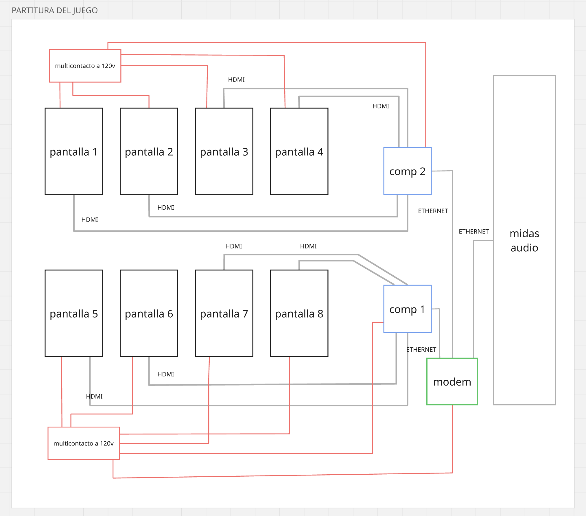

El mapa corresponde al diseño de referencia del sistema. Una máquina con dos salidas HDMI hacia dos controladores ICUIXIAN; cada controlador distribuye cuatro segmentos a cuatro pantallas. ICUIXIAN A distribuye cuatro tiras de retrato (4×1, 90°); ICUIXIAN B distribuye cuatro pantallas horizontales en mosaico (2×2, 0°). El audio sale del Mac por Dante Virtual Soundcard hacia la unidad DANTE 5 del sistema Midas.

| Color | Tipo de línea |
|---|---|
| Rojo | Alimentación 120 V desde multicontacto |
| Gris | Señal — HDMI (vídeo) y Ethernet (red) |
| Verde | Nodo de red — modem / router de la LAN |

### Lista de equipo

| Cant. | Equipo | Función en el sistema |
|---|---|---|
| 4 | Monitor / pantalla 1080×1920 (9:16, montaje en vertical) | Canales 0–3 (Muro A). Distribuidos por ICUIXIAN A en modo 4×1 con rotación 90° |
| 4 | Monitor / pantalla 1920×1080 (16:9, montaje horizontal) | Canales 4–7 (Muro B). Distribuidos por ICUIXIAN B en modo 2×2 sin rotación |
| 1 | Ordenador Mac arm64 con dos salidas HDMI independientes | Entrega dos señales 1920×1080 a 60 Hz y ejecuta ocho canales a 30 fps |
| 1 | ICUIXIAN 0104-XZ (Muro A), ASIN B0DM98NVSH | Divide la entrada 1080p60 en cuatro tiras verticales de retrato |
| 1 | ICUIXIAN 0104-XZ (Muro B), ASIN B0DM98NVSH | Divide la entrada 1080p60 en cuatro pantallas en mosaico 2×2 horizontal |
| 1 | Consola / sistema de audio Midas con unidad DANTE 5 | Recibe 8 canales via DANTE desde el Mac y los enruta a los altavoces de sala |
| 1 | Switch Gigabit con acceso a red DANTE | Red para audio DANTE y control cuando el sistema Midas lo requiere |
| 10 | Cable HDMI | Dos enlaces Mac→ICUIXIAN y ocho enlaces ICUIXIAN→pantallas |
| 1+ | Cable Ethernet Cat5e/Cat6 | Enlace hacia el switch de la red DANTE |
| 2 | Multicontacto / regleta | Un multicontacto por banco de pantallas |
| 1 | Teclado/ratón o control remoto | Acceso a la ControlApp (tecla `U`) |

Opcionales según sala: extensiones eléctricas, canaletas o cinta gaffer para el cableado, y un monitor auxiliar para la ControlApp (el `settings.json` de instalación ya reserva una ventana de control de 1400 × 900).

### Descripción del setup

**Reparto de vídeo.** La ventana A (canales 0–3) alimenta ICUIXIAN A configurado como 4×1 con rotación 90°; cada segmento de 480×1080 px se escala y rota al panel vertical correspondiente. La ventana B (canales 4–7) alimenta ICUIXIAN B configurado como 2×2; cada cuadrante de 960×540 px se escala al panel horizontal correspondiente. `presentationWindows` en `settings.json` ajusta posición y tamaño de cada ventana dentro del escritorio extendido.

**Reloj.** `GlobalDirector`, `VideoDirector` y `VisualComposer` viven en el mismo proceso. Las dos ventanas comparten contexto OpenGL y guard de fotograma, por lo que no necesitan sincronización de red.

**Audio.** SuperCollider corre en el mismo Mac y recibe OSC de los ocho canales. `pdj_audio_config.scd` detecta automáticamente Dante Virtual Soundcard; si está presente, configura 8 canales de salida a 48 kHz hacia la unidad DANTE 5. Dante Controller enruta las salidas DVS 1–8 a los canales D3-1–D3-8 de la sala. En ausencia de DANTE, el sistema cae en rescate estéreo sin cambios de código. Ver `docs/AUDIO_MULTICHANNEL_ES.md` para la configuración completa de DANTE, enrutamiento y calibración de altavoces.

**Eléctrico.** Ambos bancos de pantallas deben partir de la misma fase para evitar bucles de masa. Dimensionar el circuito para ocho pantallas, dos controladores y un ordenador.

**Orden de encendido.** Multicontactos → pantallas → unidades ICUIXIAN → ordenador → SuperCollider (`Start Audio.command` o IDE) → aplicación. Apagado en orden inverso: detener SuperCollider con `~shutdown.()` antes de deshabilitar Dante Virtual Soundcard.

---

## Referencia de montaje

Las dos vistas siguientes son la referencia espacial del montaje: las pantallas no forman un muro continuo sino que se dispersan por la sala sobre estructuras tubulares verticales de suelo a techo, de modo que el público camina entre ellas y nunca ve las ocho a la vez.

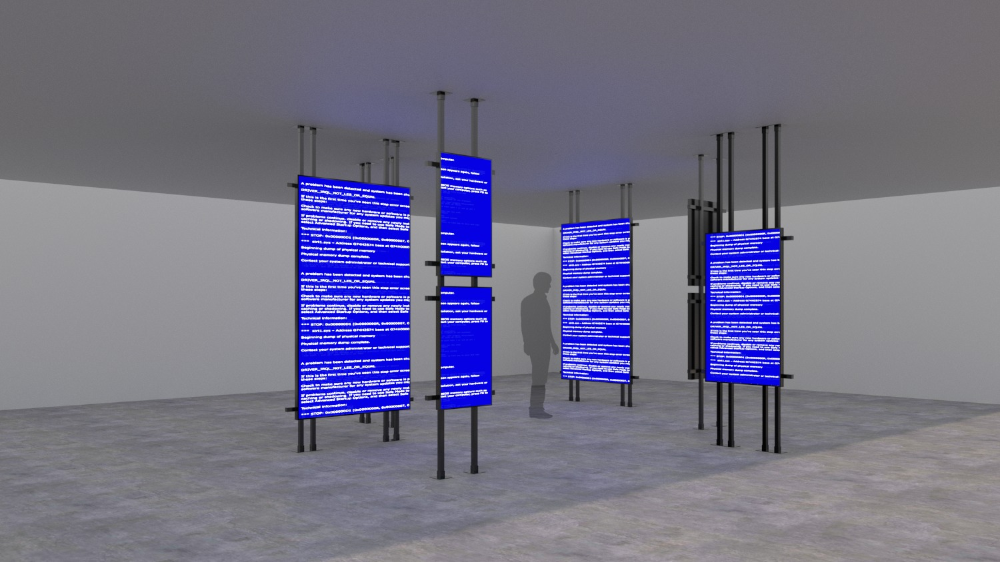

Cada estructura sostiene uno o dos paneles en vertical, sujetos por bridas o abrazaderas a los tubos. Los paneles se montan a la altura del cuerpo (centro de imagen aproximadamente a la altura de la mirada) y ligeramente girados entre sí, sin alineación frontal: las orientaciones cruzadas hacen que el espectador reciba siempre algunas pantallas de frente y otras en ángulo agudo, reforzando la lectura de las ocho columnas como polirritmia y no como una única imagen panorámica.

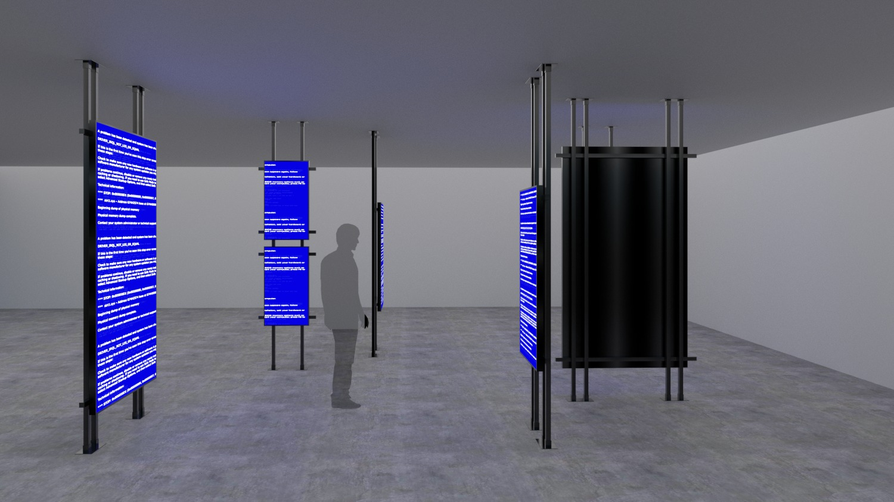

La segunda vista muestra la circulación resultante y el volumen cilíndrico negro que concentra la parte técnica del montaje: dentro se ocultan los ordenadores, el multicontacto, el router y el recogido de cables, que suben por los tubos hasta cada panel. La sala se mantiene en penumbra sin iluminación añadida —la única fuente de luz son las propias pantallas—, y el suelo se deja libre de cableado visible.

Nota sobre el ancho lógico: la cifra de 8640 px (8 × 1080) descrita en la arquitectura es la resolución total del sistema, no una dimensión física continua. Cada canal es una imagen autónoma y completa, por lo que el reparto espacial de los paneles puede adaptarse a la planta de cada sala sin modificar el software.

---

## Análisis fuera de línea (`analyzer/`)

El analizador Python procesa los clips de vídeo fuera de línea y genera paquetes PDJV que el runtime principal puede usar para enriquecer la nube de puntos.

```bash
cd analyzer
pip install -r requirements.txt

# Analizar un clip y generar el paquete PDJV
python scripts/analyze_clip.py <ruta_del_clip>

# Exportar datos de referencia (golden)
python scripts/export_golden.py

# Validar el paquete generado
python scripts/validate_package.py <ruta.pdjv>
```

El formato PDJV está completamente documentado en `docs/pdjv/PDJV_FORMAT.md`. La versión activa en producción es v1 (frozen). Los paquetes v0 siguen siendo legibles. Los paquetes de producción no deben contener imágenes de muestra (thumbnail) — el analizador genera previsualizaciones únicamente bajo `analyzer/output/`.

---

## Runtime volumétrico (`volumetric/`)

`volumetric/` es un runtime independiente que reproduce paquetes PDJV sin decodificar vídeo fuente ni usar OpenCV. No forma parte del runtime de instalación principal.

```bash
cd volumetric
make -j8
cd bin && ./volumetric.app/Contents/MacOS/volumetric
```

Requiere openFrameworks 0.12.0 en la ruta definida por `OF_ROOT` en `volumetric/config.make`. Addons: `ofxOsc`, `ofxImGui`. OpenGL 4.1, sin compute shaders.

El modo de salida `dualWindow8` genera dos ventanas de presentación 1920×1080 (grupos A/B con FBOs HDR y de retroalimentación independientes) más una ventana de control. OSC entrante en el puerto 9002: `/pdjv/generator`, `/pdjv/preset`, `/pdjv/play`.

El archivo `pdj_volumetric_compat.scd` (en `supercollider/`) registra manejadores OSC que permiten que el motor de audio reciba mensajes del runtime volumétrico en los mismos buses de control que usa el runtime de instalación principal.
