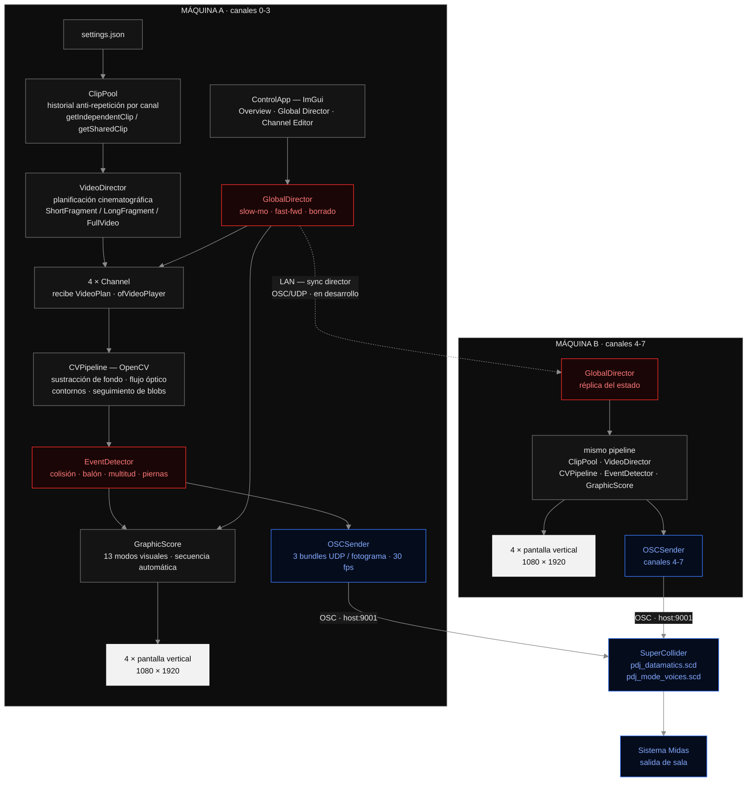
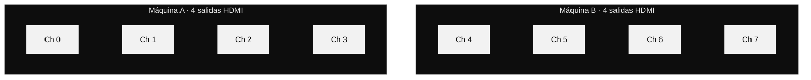
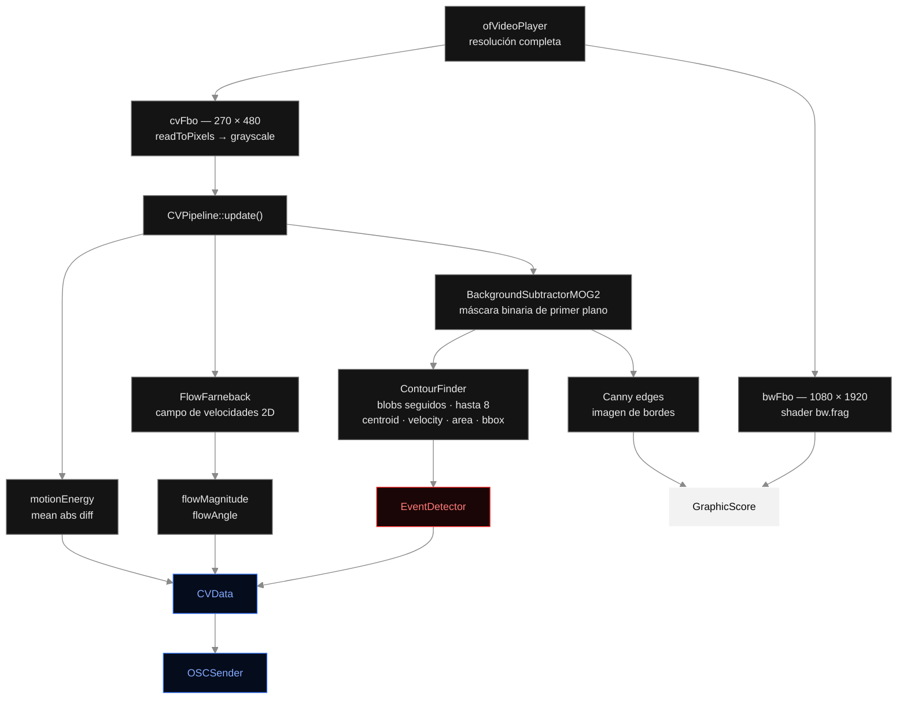
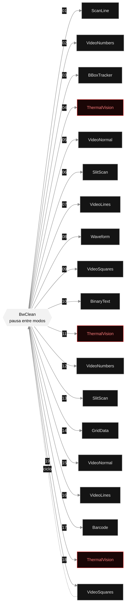
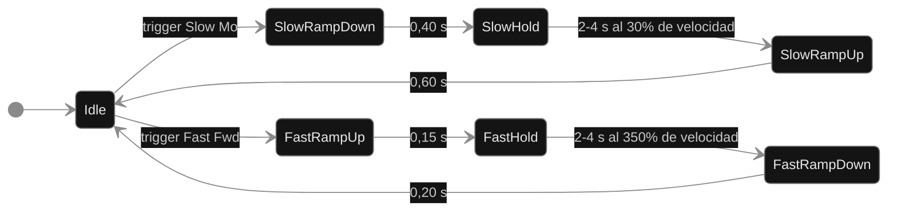
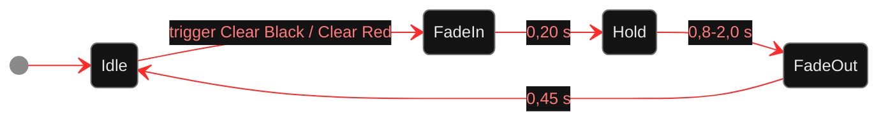
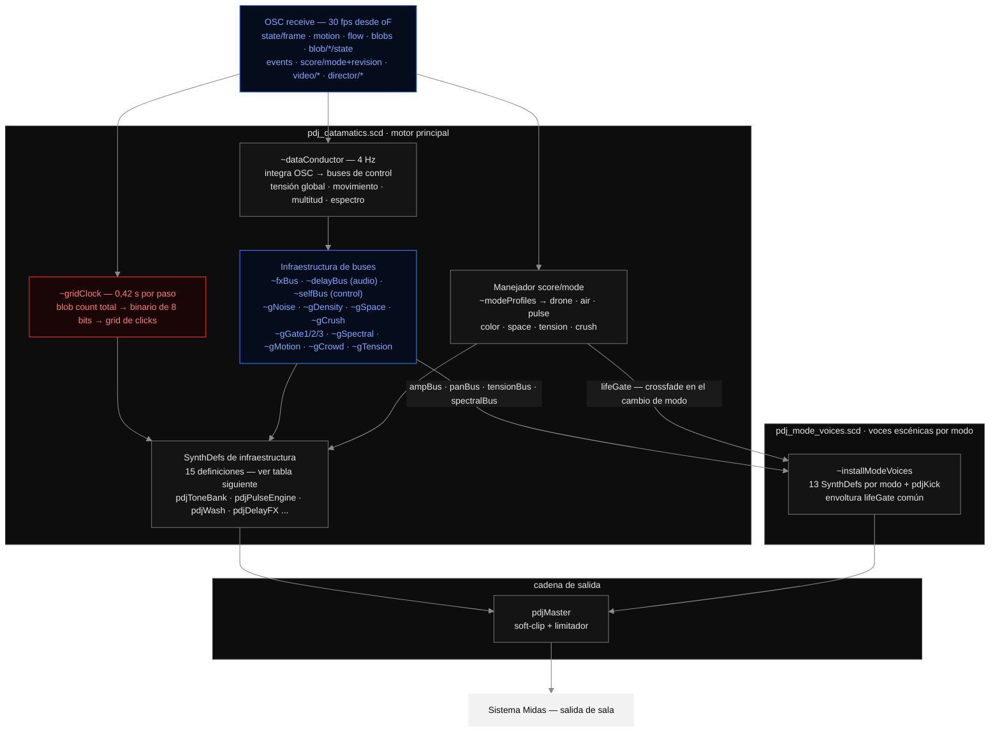

# Partitura del Juego

Instalación audiovisual generativa construida con openFrameworks (C++) y SuperCollider. La pieza procesa material de vídeo deportivo pregrabado a través de un pipeline de visión artificial en tiempo real y convierte los datos extraídos en una partitura gráfica en evolución continua, distribuida entre ocho pantallas verticales en modo retrato repartidas en dos ordenadores conectados en red. El sonido se sintetiza en vivo en SuperCollider, alimentado por el flujo CV combinado de ambas máquinas vía OSC.

> **Estado de implementación:** la arquitectura de dos máquinas con 8 canales y la capa de sincronización de red están actualmente en desarrollo. La compilación de una sola máquina con 4 canales es totalmente funcional y sirve como base de desarrollo.

---

## Concepto

El título opera sobre un doble significado: *partitura* como notación musical que prescribe qué interpretar, y *juego* como partido y como play. El vídeo deportivo —ya de por sí un documento de movimiento colectivo y acontecimiento— es releído como dato en bruto, y ese dato se convierte en notación. Los atletas se convierten en intérpretes involuntarios de una partitura que nunca verán.

La instalación no intenta analizar ni interpretar el partido. Usa el movimiento, la proximidad, las colisiones y la densidad espacial del juego puramente como señales de entrada —igual que un compositor podría usar un dado o una fuente de ruido— para generar un lenguaje visual y sonoro que bebe de la estética datamatic de Ryoji Ikeda: clínico, escaso, de alta frecuencia, indiferente a la narrativa.

---

## Arquitectura del sistema

La instalación completa corre en dos ordenadores conectados por red local. Cada máquina ejecuta la misma aplicación openFrameworks gestionando cuatro canales y cuatro monitores en vertical. Una capa de sincronización de red (en desarrollo) mantiene el estado del `GlobalDirector` coherente entre ambas máquinas. El motor de audio SuperCollider corre en una máquina y recibe OSC de ambas.



**Distribución física de los ocho canales:**



Cada monitor es 9:16 en vertical a 1080 × 1920 px. Anchura lógica total del sistema: 8640 px.

---

## Pipeline de visión artificial

Cada canal ejecuta un pipeline OpenCV independiente en cada fotograma. El vídeo se escala a la mitad de resolución para el análisis (FBO de 270×480 px), manteniendo la ruta de visualización en GPU a resolución completa (1080×1920 px).



### Sustracción de fondo

`cv::BackgroundSubtractorMOG2` mantiene un modelo estadístico del fondo sobre una ventana histórica deslizante (por defecto 120 fotogramas). Cada nuevo fotograma se compara con ese modelo para generar una máscara binaria de primer plano que aísla los cuerpos en movimiento del campo estático.

### Flujo óptico

`ofxCv::FlowFarneback` opera sobre fotogramas en escala de grises consecutivos y produce un campo de velocidades 2D por píxel. Se extraen dos valores agregados:

- **Magnitud del flujo** — longitud media del vector, codifica intensidad global del movimiento.
- **Ángulo del flujo** — dirección media del vector, codifica dirección dominante.

### Detección de contornos y seguimiento de blobs

`ofxCv::ContourFinder` umbraliza la máscara de primer plano y encuentra contornos. Cada contorno es un blob seguido con posición normalizada (x, y), velocidad entre fotogramas (vx, vy), área, dimensiones del bounding box y etiqueta persistente. Se acumula también la **longitud total de contorno** como medida de la complejidad visual de la disposición de jugadores.

### Detección de bordes

Canny opera sobre el fotograma en escala de grises con umbrales bajo/alto configurables. La imagen resultante la usan directamente varios modos visuales (Barcode, VideoLines).

### Detección de eventos

`EventDetector` interpreta los datos de blobs en cuatro eventos de nivel superior:

| Evento | Lógica de detección |
|---|---|
| **Colisión** | IoU entre bounding boxes supera el umbral, o el recuento de blobs cae bruscamente |
| **Balón** | Blob menor que `ballMaxArea` px² cuya velocidad supera `ballMinSpeed` |
| **Multitud** | Al menos `crowdMinBlobs` blobs dentro del radio normalizado `crowdMaxDist` |
| **Distancia de piernas** | Elongación media de los blobs (bbH / √area), proxy de jugadores de pie |

---

## Técnicas visuales

La partitura gráfica cicla a través de 13 modos de renderizado secuenciados automáticamente. Cada modo dura un tiempo aleatorio entre `minModeDuration` y `maxModeDuration` segundos. Se inserta una pausa `BwClean` entre cada modo activo, enmarcando cada técnica como un episodio diferenciado.

`buildSequence()` recorre 19 modos activos por ciclo. Cada técnica entra desde el negro filmado y vuelve a él, de modo que la pausa es el eje de toda la partitura:



En rojo, las tres apariciones de `ThermalVision` — el estribillo más marcado del ciclo. `SlitScan`, `VideoLines`, `VideoNumbers`, `VideoNormal` y `VideoSquares` reaparecen dos veces cada uno; `BBoxTracker`, `Waveform`, `BinaryText`, `GridData` y `Barcode` suenan una sola vez por ciclo.

### Base fílmica — shader B&W (`bw.frag`)

Todos los modos que no usan color en bruto comienzan con este shader GLSL. Convierte el vídeo a escala de grises con coeficientes Rec.709 y aplica:

| Parámetro | Función |
|---|---|
| Gamma | Curva de gamma (por defecto 0,95) |
| Contraste / Brillo | Ajuste lineal alrededor del punto medio 0,5 |
| Curva S fílmica | Hermite smooth-step: levanta sombras, comprime altas luces |
| Viñeta elíptica | Oscurecimiento de bordes, más ancho horizontalmente |
| Grano animado | Hash noise jittered por el tiempo — patrón diferente cada fotograma |
| Posterización | Cuantiza luminancia a N pasos (256 = desactivado) |
| Umbral duro | Borde smooth-step para aspecto gráfico (0 = desactivado) |

### Modos de partitura

**BwClean** — base fílmica sin superposición. Pausa visual entre modos.

**ScanLine** — líneas horizontales cuya longitud se modula por `motionEnergy × sin(y, tiempo)`. Mira de cruz sobre el balón cuando se detecta.

**BBoxTracker** — bounding boxes con marcas de esquina (estética de cámara de vigilancia), etiquetas de blob ID, flechas de velocidad por centroide, círculo de balón.

**BinaryText** — posiciones y velocidades de blobs codificadas como cadenas binarias de 8 bits en texto denso. Barra de densidad de multitud en la parte inferior.

**Waveform** — histórico de `motionEnergy` como gráfico de barras horizontales (hasta 1920 muestras = ~64 s a 30 fps). Rastro de puntos en el borde derecho.

**GridData** — cuadrícula 32×48 de cruces cuya longitud de brazo se modula por `motionEnergy × sin(col, fila, tiempo)`. Centroides de blobs activos marcados con cruces mayores y coordenadas.

**Barcode** — máscara de primer plano comprimida en 64 barras verticales. Altura de barra = densidad media de primer plano por columna.

**VideoNormal** — vídeo en color en bruto, cover-cropped. Momento de contraste con la imagen directa.

**VideoSquares** — base B&W con hasta 6 parches de vídeo en color centrados en los blobs activos. Marcos con ticks de esquina y etiquetas de ID.

**VideoNumbers** — cuadrícula 36×64 de dígitos 0–9 mapeados al brillo de cada celda. Las celdas oscuras se omiten. Texto que también es imagen.

**VideoLines** — dibujo de líneas en tres capas:
1. *CLD* — filtrado bilateral + `ofxCv::CLD` (FDoG) extrae líneas interiores con calidad de lápiz.
2. *Siluetas FG* — contornos de la máscara cerrados morfológicamente, aproximados con `approxPolyDP`, suavizados (`getSmoothed(9)`) y redibujados en tres pasadas: halo ancho · brillo medio · tinta nítida.
3. *Trazos de flujo* — vectores Farneback como segmentos de línea dirigidos sobre una cuadrícula.

**ThermalVision** — mapa de colores Ironbow / FLIR via `thermal.frag`: negro (frío) → violeta → carmesí → naranja → amarillo → blanco (caliente). Artefacto de cuadrícula de sensor animada. Barra de gradiente en borde derecho. Marcas térmicas por blob.

**SlitScan** — slit-scan temporal. La columna central del fotograma en escala de grises se escribe en un buffer circular de 270 columnas. El buffer se despliega izquierda (pasado) → derecha (presente). Eje de tiempo etiquetado en segundos en la parte inferior.

**Flash** — rectángulo blanco de pantalla completa que se desvanece de alpha 200 a 0 en `flashDuration` (0,25 s). Se activa automáticamente en colisiones detectadas.

### Elementos visuales persistentes

**Ciclo de color de marcas** — en cada transición de modo el color avanza: blanco → rojo → azul eléctrico → repetir.

**Strobe de clip** — en cada cambio de clip un rectángulo blanco o rojo se desvanece a 1100 alpha/s (~0,23 s).

**HUD de datos** — siempre visible sobre cualquier modo: barra de energía vertical (2 px) en el borde izquierdo, contador de fotogramas y recuento de blobs en la esquina inferior izquierda, mira de cruz sobre el balón cuando se detecta.

---

## Elementos compositivos

### La secuencia como partitura

La secuencia en `buildSequence()` prescribe un orden fijo de técnicas separadas por pausas `BwClean`. Como cada modo dura un tiempo aleatorio, la secuencia es indeterminada en duración pero determinada en orden. `ThermalVision` aparece tres veces, `SlitScan` y `VideoLines` dos veces cada una. Las repeticiones funcionan como estribillos.

### El GlobalDirector

`GlobalDirector` aplica manipulación temporal a todos los canales simultáneamente. Tres procesos independientes en máquina de estados propia:

**Proceso temporal** — cámara lenta y avance rápido comparten el estado `Idle`, por lo que son mutuamente excluyentes:



**Proceso de borrado** — independiente del temporal, puede solaparse con él:



Todos los ramps usan ease Hermite: `t² × (3 − 2t)`.

| Parámetro | Valor por defecto |
|---|---|
| Velocidad lenta | 30% de la velocidad base |
| Velocidad rápida | 350% de la velocidad base |
| Auto-disparo | Desactivado por defecto (control manual desde la ControlApp) |
| Paleta de borrado | rojo vivo → negro → flash blanco → negro → carmesí → negro (ciclo) |

Los disparadores manuales (Slow Mo, Fast Fwd, Clear Black, Clear Red) están disponibles en todo momento desde la ControlApp. Los auto-disparadores se habilitan por separado (`autoSlow`, `autoFast`, `autoClear`).

**Sincronización entre máquinas (en desarrollo):** la Máquina A actúa como autoridad. Cuando su director dispara cualquier trigger, emite el evento y el estado completo de parámetros a la Máquina B por OSC/UDP. El guard interno de fotograma en `GlobalDirector` evita actualizaciones duplicadas.

### Director de Vídeo (VideoDirector)

`VideoDirector` es el director cinematográfico del material de archivo. Gestiona qué clip se reproduce en cada canal, desde qué punto y durante cuánto tiempo, introduciendo además **eventos compartidos** donde los cuatro canales reproducen el mismo fragmento simultáneamente.

`VideoDirector::update()` se llama cada fotograma y alterna entre dos regímenes: programación independiente por canal y, periódicamente, el evento compartido con su protocolo de arranque sincronizado.

```mermaid
%%{init: {"theme":"base","themeVariables":{"fontFamily":"ui-monospace, SFMono-Regular, Menlo, monospace","fontSize":"13px","primaryColor":"#141414","primaryTextColor":"#e8e8e8","primaryBorderColor":"#707070","lineColor":"#8a8a8a","actorBkg":"#141414","actorTextColor":"#e8e8e8","actorBorder":"#707070","actorLineColor":"#4a4a4a","signalColor":"#8a8a8a","signalTextColor":"#e8e8e8","labelBoxBkgColor":"#141414","labelBoxBorderColor":"#707070","labelTextColor":"#e8e8e8","loopTextColor":"#e8e8e8","noteBkgColor":"#1a0606","noteTextColor":"#ff7a7a","noteBorderColor":"#ff2b2b","sequenceNumberColor":"#0a0a0a"}}}%%
sequenceDiagram
    autonumber
    participant VD as VideoDirector
    participant CP as ClipPool
    participant CH as 4 × Channel

    rect rgb(18,18,18)
    Note over VD,CH: Programación independiente — por canal
    VD->>CP: getIndependentClip(canal)
    CP-->>VD: clip fuera del historial de 3
    VD->>CH: VideoPlan · tipo · startFraction · requestedDuration · revision
    CH->>CH: seek al punto de inicio · segmentStart / segmentEnd
    CH-->>VD: reportFinished() al terminar el segmento
    end

    rect rgb(26,6,6)
    Note over VD,CH: Evento compartido — cada 2-5 min
    VD->>CP: getSharedClip()
    CP-->>VD: clip compartido no usado recientemente
    VD->>CH: beginShared() — mismo VideoPlan a los 4 canales
    CH-->>VD: reportReady() — clip cargado, inicio calculado
    VD->>VD: WaitingToStart — espera sharedStartDelay 0,35 s
    VD->>CH: Playing — sharedMediaSeconds_ avanza con el tiempo real
    VD->>CH: finishShared() — vuelta a planificación independiente
    end
```



**Tipos de plan:**

| Tipo | Duración | Peso por defecto |
|---|---|---|
| `ShortFragment` | 8–25 s | 50% |
| `LongFragment` | 30–120 s | 30% |
| `FullVideo` | duración completa del clip | 20% |

Cada plan incluye una `startFraction` aleatoria (punto de inicio normalizado 0–1 dentro del clip) y un `revision` entero que permite al canal detectar si recibió un plan actualizado.

El canal implementa la lógica de reproducción del plan: busca el punto de inicio correcto, configura el segmento con `segmentStartSeconds_` / `segmentEndSeconds_`, y llama a `reportFinished()` cuando el segmento termina. Para el evento compartido, además llama a `reportReady()` una vez que el clip está cargado y el punto de inicio calculado, de modo que el `VideoDirector` puede coordinar el arranque simultáneo.

### Pool de Clips (ClipPool)

`ClipPool` gestiona el acceso al inventario de clips con dos estrategias distintas:

**Clips independientes** (`getIndependentClip`):
- Evita clips activos en otros canales en ese momento.
- Mantiene un historial deslizante de 3 clips por canal para evitar repetición inmediata.
- Relaja las restricciones en cascada si el pool es pequeño: historial → exclusividad entre canales → cualquier clip.

**Clip compartido** (`getSharedClip`):
- Mantiene su propio historial deslizante de 3 clips para el evento compartido.
- Elige entre todos los clips no utilizados recientemente en eventos compartidos.

### Ocho canales en dos máquinas

Cada máquina ejecuta cuatro instancias del pipeline en paralelo. Dentro de una máquina el `ClipPool` y el `VideoDirector` son compartidos por los cuatro canales, de modo que la programación es coordinada (no hay dos canales jugando el mismo clip simultáneamente en modo independiente). Across ambas máquinas, la poliritmia visual se extiende a ocho columnas.

El `GlobalDirector` sincroniza la sensación temporal en los ocho canales: dentro de una máquina en proceso; entre máquinas mediante la capa de red en desarrollo.

Distribución de monitores:
- Máquina A → columnas 0–3 (banco izquierdo)
- Máquina B → columnas 4–7 (banco derecho)
- Anchura total: 8640 px (8 × 1080). Cada monitor es 9:16 en vertical.

### Transmisión de datos OSC

Cada máquina transmite tres bundles UDP por fotograma (~30 fps). Las direcciones son indexadas por canal (`/pdj/channel/0` a `/pdj/channel/3` por máquina).

**Bundle core** — un mensaje por valor escalar:

| Dirección | Tipo | Contenido |
|---|---|---|
| `.../state/frame` | int | contador monotónico — detecta paquetes perdidos |
| `.../state/time` | float | segundos transcurridos oF |
| `.../flow/magnitude` | float | longitud media del vector Farneback |
| `.../flow/angle` | float | dirección media del vector (radianes) |
| `.../motion/energy` | float | diferencia absoluta media entre fotogramas, 0–1 |
| `.../blobs/count` | int | número de contornos activos |
| `.../contour/length` | float | perímetro total de contornos (px, resolución de análisis) |
| `.../event/collision` | int | 0 ó 1 |
| `.../event/ball` | int | 0 ó 1 |
| `.../event/ball/x` | float | x normalizada del balón, 0–1 |
| `.../event/ball/y` | float | y normalizada del balón, 0–1 |
| `.../event/crowd` | float | densidad de multitud, 0–1 |
| `.../event/leg_distance` | float | elongación media de blobs, 0–1 |

**Bundle de blobs** — siempre 8 mensajes (uno por slot); slots inactivos llevan ceros:

| Dirección | Args (en orden) |
|---|---|
| `.../blob/{0-7}/state` | active(int) x y vx vy area bbW bbH (todos float, normalizados) |

**Bundle de contexto** — reenviado cada fotograma para recuperar paquetes perdidos:

| Dirección | Tipo | Contenido |
|---|---|---|
| `.../video/name` | string | nombre del clip activo |
| `.../video/position` | float | posición de reproducción, 0–1 |
| `.../video/duration` | float | duración del clip en segundos |
| `.../video/revision` | int | se incrementa en cada cambio de clip |
| `.../score/mode` | int | modo visual activo 0–13 |
| `.../score/revision` | int | se incrementa en cada transición de modo |
| `.../director/temporal` | int | `TemporalPhase`: 0=Idle 1=SlowRampDown 2=SlowHold 3=SlowRampUp 4=FastRampUp 5=FastHold 6=FastRampDown |
| `.../director/speed` | float | multiplicador de velocidad actual |
| `.../director/clear` | int | `ClearPhase`: 0=Idle 1=FadeIn 2=Hold 3=FadeOut |
| `.../director/clear_alpha` | float | opacidad del borrado, 0–1 |

### Motor de audio SuperCollider

El motor comprende dos archivos:

- **`pdj_datamatics.scd`** — motor principal: infraestructura de buses, SynthDefs de infraestructura, sistema de formas, conductor de datos, secuenciador binario en cuadrícula, manejadores OSC y vigilancia de telemetría.
- **`pdj_mode_voices.scd`** — voces escénicas específicas por modo: un SynthDef por cada uno de los 13 modos del ScoreMode, más `pdjKick`.



**Voces específicas por modo (`pdj_mode_voices.scd`):**

Cada modo visual tiene su propio SynthDef con una identidad sonora coherente con la imagen. Todos comparten la misma envoltura de vida (`lifeGate`) para crossfades suaves en el cambio de modo, y todos leen los mismos buses de control (`ampBus`, `panBus`, `tensionBus`, `spectralBus`). La función de síntesis recibe como argumentos `base` (frecuencia fundamental del canal), `anchor` (ancla espectral compartida), `tension`, `activity`, `color`, `variant` y `evo` (evolución temporal 0–1).

| SynthDef | Carácter sonoro |
|---|---|
| `pdjModeBwClean` | Drone de senos puro con noise marrón filtrado a baja densidad |
| `pdjModeScanLine` | Senos fijos + noise rosa con centro espectral que barre lentamente |
| `pdjModeBBoxTracker` | Parciales superiores impares + noise rosa centrado en el ancla |
| `pdjModeBinaryText` | Senos con step LFNoise0 + pulso LP (cadencia de datos binarios) |
| `pdjModeWaveform` | Drone ondulatorio de tres parciales + noise marrón que respira |
| `pdjModeGridData` | Drone base + Ringz multi-parcial activado por Dust |
| `pdjModeBarcode` | Senos bajos + noise gris en tres centros filtrados + CombL |
| `pdjModeVideoNormal` | Drone cálido de cuatro parciales + noise marrón armónico |
| `pdjModeVideoSquares` | Seno base + cuatro BPFs en torno al ancla que derivan lentamente |
| `pdjModeVideoNumbers` | Senos cuya razón sigue un dígito LFNoise0 + BPF proporcional |
| `pdjModeVideoLines` | Senos de borde + tres BPFs de noise rosa (silueta → línea → haz) |
| `pdjModeThermal` | Tríada de senos sub-temperatura + noise marrón LP que asciende |
| `pdjModeSlitScan` | Drone + BPF + CombL con retardo largo (tiempo comprimido en eco) |
| `pdjModeFlash` | Seno fundamental + 16.º parcial + BPF en el ancla × 3,5 |

`pdjKick` — golpe grave cinematográfico (body sinusoidal con pitch sweep + edge de noise rosa) usado por el secuenciador de cuadrícula y eventos de colisión de alta energía.

**SynthDefs de infraestructura:**

| SynthDef | Función |
|---|---|
| `pdjToneBank` | Cuatro familias de drone (abismo/cine, barrido/vigilancia, datos/cristal, temporal/niebla); voz activa seleccionada por el modo visual |
| `pdjPulseEngine` | Continuo click → ritmo → pitch → ruido: un tren de Impulse cuya tasa impulsa el CV en vivo |
| `pdjNoiseBed` | Noise de banda de paso por canal siguiendo el ancla espectral compartida |
| `pdjSpectralAnchor` | Frecuencia central de deriva lenta compartida por `pdjWash` y `pdjNoiseBed` |
| `pdjWash` | Portador ambiente principal |
| `pdjCrackle` | Grano escaso activado por Dust |
| `pdjSub` | Presión sinusoidal baja siguiendo densidad de multitud |
| `pdjClick` | Click corto de barrido estéreo para colisión/balón |
| `pdjGlitch` | Ráfaga de glitch digital para cortes de modo |
| `pdjImpact` | Onda de presión cinematográfica baja para colisiones |
| `pdjTrace` | Arco espacial corto para detección de balón |
| `pdjClearSweep` | Elevación espectral difusa en evento de borrado |
| `pdjDelayFX` | Reflexiones tempranas + reverberación algorítmica |
| `pdjSelfAnalysis` | Retroalimentación meta: lee amplitud del master a un bus de control |
| `pdjMaster` | Soft-clip + limitador en la salida |

**Mapeo de escena visual:** cada modo selecciona un perfil `~modeProfiles` con valores de `drone`, `air`, `pulse`, `color`, `space`, `tension` y `crush`. El `~dataConductor` integra el CV a 4 Hz, calcula tensión global y espectro objetivo, y actualiza todos los buses. El estado del director (lento/rápido/clear) transforma la voz: lento → haze temporal; rápido → datos/cristal.

**Secuenciador binario:** cada 0,42 s, la suma de blobs en todos los canales se lee como número binario de 8 bits. Cada bit activo dispara un click en esa posición de cuadrícula a un pitch que codifica el índice del bit (1800–8100 Hz).

**Vigilancia de telemetría:** un canal cuyo paquete `state/frame` no llega en 1 s se marca como offline con aviso en consola.

El motor está configurado para `~numChannels = 4`. Expandir a 8 canales para la configuración de dos máquinas requiere actualizar `~numChannels` y el array `~channelBases`.

---

## Interfaz de control (ControlApp)

La ControlApp es una ventana ImGui independiente accesible con la tecla `U`. Está organizada en tres pestañas.

### Vista general


La pestaña **Overview** muestra el estado operativo de los cuatro canales simultáneamente. Cada columna presenta transporte (clip activo, Next / Pause / Stop, velocidad), modo visual activo, estado en vivo de los cuatro detectores de eventos (Collision, Ball, Crowd density, Leg distance) y telemetría CV cuadro a cuadro (Motion energy, Flow magnitude, Flow angle, Blobs, Contour). La barra superior expone la configuración OSC y el total de clips disponibles. La tecla `U` oculta toda la interfaz para la presentación.

---

### Director Global


La pestaña **Global Director** centraliza el control temporal de todos los canales. La línea de estado muestra la fase temporal activa, el multiplicador de velocidad y el estado del borrado.

**Disparadores manuales:**

| Botón | Acción |
|---|---|
| Slow Mo | Inicia cámara lenta en todos los canales |
| Fast Fwd | Inicia avance rápido en todos los canales |
| Clear Black | Borrado de pantalla en negro |
| Clear Red | Borrado de pantalla en rojo |

Los toggles **Auto Slow**, **Auto Fast** y **Auto Clear** habilitan el disparado automático de cada proceso. Por defecto están desactivados para que el intérprete decida cuándo actuar.

Los tres bloques de parámetros (Slow Motion, Fast Forward, Screen Clear) ajustan velocidades objetivo, duraciones de rampa y retención, e intervalos de auto-disparo en segundos.

---

### Editor de canal


La pestaña **Channel Editor** permite editar en detalle cualquiera de los cuatro canales. Cuatro bloques de parámetros:

**IMAGE** — controla el shader B&W:

| Parámetro | Efecto |
|---|---|
| Contrast / Bright | Ajuste lineal de contraste y brillo |
| Gamma | Curva de gamma |
| S curve | Intensidad de la curva S fílmica |
| Grain | Amplitud del grano analógico animado |
| Vignette | Intensidad del oscurecimiento elíptico |
| Threshold | Umbral duro B&W (0 = desactivado) |
| Posterize | Cuantización de niveles (256 = desactivado) |
| CLAHE / Clip | Mejora de contraste adaptativa local |

**COMPUTER VISION** — pipeline OpenCV:

| Parámetro | Efecto |
|---|---|
| Enabled | Activa / desactiva el análisis CV del canal |
| Blob thr | Umbral de binarización para contornos |
| Min area | Área mínima en px² para blobs válidos |
| Canny low / high | Umbrales del detector de bordes Canny |

**EVENTS** — sensibilidad de detectores:

| Parámetro | Efecto |
|---|---|
| Ball area | Área máxima en px² para considerar blob como balón |
| Ball speed | Velocidad mínima normalizada para confirmar balón |
| Crowd N | Blobs mínimos para evento de multitud |
| Crowd dist | Radio normalizado de agrupación |
| Overlap | Umbral IoU para colisión |

**SCORE** — director de partitura gráfica:

| Parámetro | Efecto |
|---|---|
| Min dur / Max dur | Rango aleatorio de duración de modo en segundos |
| Flash | Duración del flash blanco en colisión |
| Opacity | Opacidad global de las marcas |
| Mode (dropdown) | Fuerza un modo fijo o deja Auto para la secuencia automática |
| Active | Modo activo en este instante |
| Square / Sq count | Tamaño y número máximo de parches en VideoSquares |
| Slit W | Anchura de la franja en SlitScan |

La sección **LIVE CV DATA** muestra flujo, ángulo, energía, blobs y contorno en tiempo real.

---

## Dependencias

| Biblioteca | Función |
|---|---|
| openFrameworks | gráficos, reproducción de vídeo, gestión de ventanas |
| ofxOpenCv | wrapper de OpenCV para openFrameworks |
| ofxCv | utilidades CV de alto nivel (CLD, Farneback, ContourFinder) |
| ofxOsc | envío/recepción OSC |
| ofxImGui | panel de control basado en ImGui |
| OpenCV | sustracción de fondo (MOG2), bordes, flujo óptico |
| SuperCollider | motor de síntesis de audio |
| Syphon | (incluido) compartición de texturas GPU |
| FMOD | (incluido) |

---

## Configuración

Todos los parámetros en tiempo de ejecución están en `bin/data/settings.json`:

```jsonc
{
    "osc": { "host": "localhost", "port": 9001 },

    // Posiciones de ventana (coordenadas de pantalla)
    "channels": [
        { "x": 0,    "y": 0, "width": 1080, "height": 1920 },
        { "x": 1080, "y": 0, "width": 1080, "height": 1920 },
        { "x": 2160, "y": 0, "width": 1080, "height": 1920 },
        { "x": 3240, "y": 0, "width": 1080, "height": 1920 }
    ],
    "controlWindow": { "x": 4320, "y": 0, "width": 1280, "height": 800 },

    "targetFPS": 30,

    // Parámetros de visión artificial
    "cv": {
        "halfRes": true,
        "flowWindowSize": 8,
        "blobMinArea": 500,
        "blobMaxArea": 200000,
        "bgSubHistory": 120,
        "bgSubThreshold": 25.0
    },

    // Planificación cinematográfica de vídeo
    "videoDirector": {
        "enabled": true,
        "shortWeight": 0.50,   // probabilidad de fragmento corto
        "longWeight":  0.30,   // probabilidad de fragmento largo
        "fullWeight":  0.20,   // probabilidad de vídeo completo
        "shortMin": 8,  "shortMax": 25,    // segundos
        "longMin": 30,  "longMax": 120,
        "sharedIntervalMin": 120, "sharedIntervalMax": 300,  // evento compartido
        "sharedStartDelay": 0.35,   // segundos de espera para arranque sincronizado
        "driftTolerance": 0.08      // tolerancia de deriva de posición normalizada
    }
}
```

**Presets de distribución incluidos:**

| Clave | Uso |
|---|---|
| `channels` (array activo) | posiciones de ventana actuales |
| `_testLayout` | desarrollo — 4 ventanas pequeñas en una pantalla |
| `_installationLayout` | instalación — 4 × 1080×1920 en vertical |
| `_installationControl` | ventana de control en instalación |

Para la configuración de dos máquinas, cada máquina usa su propia copia de `settings.json` con coordenadas de ventana relativas a sus pantallas. El bloque `osc.host` en la Máquina B debe apuntar a la IP de la Máquina A. La capa de sincronización de red planificada añadirá un bloque `networkSync`.

La ControlApp (tecla `U`) da acceso en vivo a todos los parámetros sin recompilar. En la configuración de dos máquinas, la ControlApp de la Máquina A es la superficie de control principal.

---

## Ejecución

### Desarrollo (una máquina, 4 canales)

```bash
# Editar settings.json: sustituir "channels" por _testLayout para ventanas pequeñas
make && bin/Partitura_del_Juego

# Audio — iniciar SuperCollider después de que oF esté en marcha
# Abrir supercollider/pdj_datamatics.scd
# Cmd+Enter sobre el bloque exterior (carga pdj_mode_voices.scd automáticamente)
# OSC host/puerto debe coincidir con settings.json (por defecto localhost:9001)

# Flujo de audio sintético sin oF
~testOsc.play;

# Apagar audio
~shutdown.();
```

### Instalación (dos máquinas, 8 canales)

Ambas máquinas deben tener copias idénticas de la carpeta `cortos/` y la aplicación compilada.

**Máquina A (primaria):**

```bash
# settings.json: usar _installationLayout (canales 0–3)
# osc.host: localhost
# networkSync.role: "primary"   [campo planificado]
# networkSync.broadcastTo: "<IP Máquina B>:<puerto>"  [campo planificado]
make && bin/Partitura_del_Juego

# SuperCollider
# Editar pdj_datamatics.scd: ~numChannels = 8
# Actualizar ~channelBases para 8 canales
# Cmd+Enter
```

**Máquina B (secundaria):**

```bash
# settings.json: usar _installationLayout (canales 4–7, ajustar x para los monitores de B)
# osc.host: <IP Máquina A>
# networkSync.role: "secondary"  [campo planificado]
# networkSync.listenPort: <puerto>  [campo planificado]
make && bin/Partitura_del_Juego
# No se necesita SuperCollider en B
```

**Orden de arranque:** iniciar primero la Máquina A (SuperCollider y director listos) y después la Máquina B. La ControlApp de la Máquina A es la superficie de control principal de la instalación completa.

---

## Mapa técnico de la instalación


El mapa describe el cableado físico de la instalación completa: ocho pantallas verticales, dos ordenadores, la consola de audio, el router de red local y la distribución eléctrica. Los colores del diagrama codifican el tipo de línea:

| Color | Tipo de línea |
|---|---|
| Rojo | Alimentación 120 V desde multicontacto |
| Gris | Señal — HDMI (vídeo) y Ethernet (red) |
| Verde | Nodo de red — modem / router de la LAN |

### Lista de equipo

| Cant. | Equipo | Función en el sistema |
|---|---|---|
| 8 | Monitor / pantalla 1080 × 1920 (9:16, montaje en vertical) | Una pantalla por canal — salida de `GraphicScore`. Rotadas a modo retrato desde el sistema operativo |
| 2 | Ordenador (comp 1 / comp 2) con 4 salidas de vídeo cada uno | Cada máquina ejecuta una instancia de `Partitura_del_Juego` con 4 canales. Requieren GPU capaz de sostener 4 × 1080×1920 a 30 fps |
| 1 | Consola / sistema de audio Midas | Salida y mezcla del motor SuperCollider hacia el sistema de sala |
| 1 | Modem / router con switch Gigabit | LAN de la instalación — transporta el OSC de sincronización del `GlobalDirector` y el OSC de datos hacia SuperCollider |
| 8 | Cable HDMI | Un cable por pantalla, 4 desde cada ordenador |
| 3 | Cable Ethernet Cat5e/Cat6 | comp 1 → router, comp 2 → router, y enlace de red hacia el sistema Midas |
| 2 | Multicontacto / regleta a 120 V | Un multicontacto por banco: alimenta 4 pantallas + 1 ordenador |
| 1 | Adaptador de teclado/ratón o control remoto en la máquina primaria | Acceso a la ControlApp (tecla `U`) durante la función |

Opcionales según sala: extensiones eléctricas, canaletas o cinta gaffer para el cableado, y un monitor auxiliar para la ControlApp (el `settings.json` de instalación ya reserva una ventana de control de 1280 × 800).

### Descripción del setup

**Reparto de vídeo.** Cada ordenador alimenta cuatro pantallas por HDMI. Un ordenador corre los canales 0–3 (pantallas 1–4) y el otro los canales 4–7 (pantallas 5–8), exactamente el reparto descrito en *Ocho canales en dos máquinas*. En cada máquina, el `settings.json` usa el preset `_installationLayout` y las coordenadas `x` de las cuatro ventanas se ajustan a la posición real de sus monitores en el escritorio extendido.

**Red.** Ambos ordenadores se conectan al router por Ethernet cableado (nunca Wi-Fi: la sincronización del `GlobalDirector` y los tres bundles OSC por fotograma dependen de latencia estable). El router solo se usa como switch de la instalación; no requiere salida a internet. La máquina primaria es la que corre SuperCollider y actúa como autoridad del director; en la secundaria, `osc.host` apunta a la IP de la primaria.

**Audio.** SuperCollider corre en una sola máquina y recibe el OSC de los ocho canales. Su salida va al sistema Midas a través del enlace de red del diagrama (o por interfaz de audio si se prefiere salida analógica), y desde ahí al sistema de sala. La máquina que sostiene el audio es la única que necesita `pdj_datamatics.scd` cargado, con `~numChannels = 8` y `~channelBases` ampliado a ocho canales.

**Eléctrico.** Cada banco de cuatro pantallas comparte multicontacto con su ordenador, y ambos multicontactos parten de la misma fase de 120 V para evitar bucles de masa entre los bancos y la consola de audio. Consumo estimado: 8 pantallas + 2 ordenadores, a dimensionar según el modelo exacto de monitor antes de asignar circuitos.

**Orden de encendido.** Multicontactos → pantallas (verificar rotación a vertical) → router → máquina primaria (`make && bin/Partitura_del_Juego`, después SuperCollider) → máquina secundaria. Apagado en orden inverso.

---

## Referencia de montaje

Las dos vistas siguientes son la referencia espacial del montaje: las pantallas no forman un muro continuo sino que se dispersan por la sala sobre estructuras tubulares verticales de suelo a techo, de modo que el público camina entre ellas y nunca ve las ocho a la vez.


Cada estructura sostiene uno o dos paneles en vertical, sujetos por bridas o abrazaderas a los tubos. Los paneles se montan a la altura del cuerpo (centro de imagen aproximadamente a la altura de la mirada) y ligeramente girados entre sí, sin alineación frontal: las orientaciones cruzadas hacen que el espectador reciba siempre algunas pantallas de frente y otras en ángulo agudo, reforzando la lectura de las ocho columnas como polirritmia y no como una única imagen panorámica.


La segunda vista muestra la circulación resultante y el volumen cilíndrico negro que concentra la parte técnica del montaje: dentro se ocultan los ordenadores, el multicontacto, el router y el recogido de cables, que suben por los tubos hasta cada panel. La sala se mantiene en penumbra sin iluminación añadida —la única fuente de luz son las propias pantallas—, y el suelo se deja libre de cableado visible.

Nota sobre el ancho lógico: la cifra de 8640 px (8 × 1080) descrita en la arquitectura es la resolución total del sistema, no una dimensión física continua. Cada canal es una imagen autónoma y completa, por lo que el reparto espacial de los paneles puede adaptarse a la planta de cada sala sin modificar el software.
