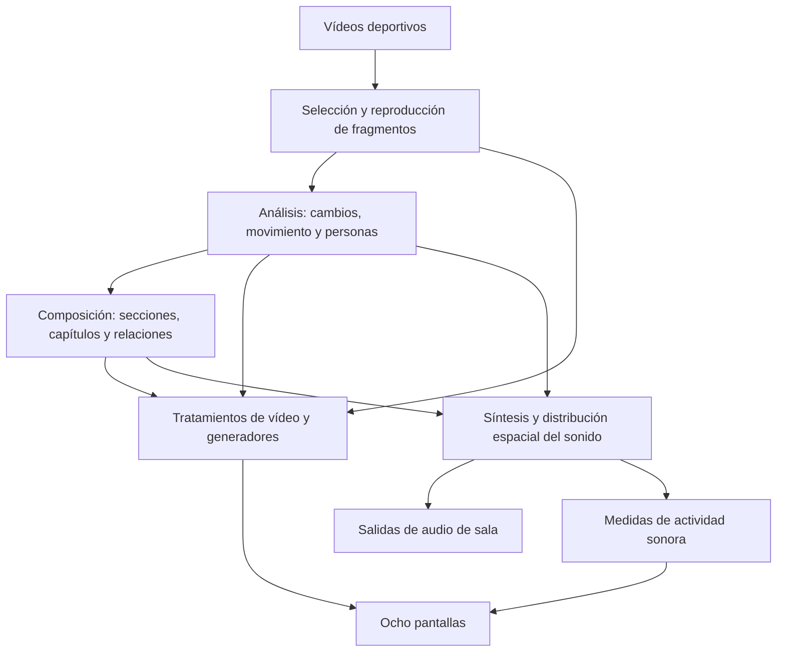

# Partitura del Juego

*Partitura del Juego* transforma vídeos deportivos en una composición de
imágenes y sonidos. Ocho pantallas presentan cuerpos, líneas, cifras, puntos y
texturas; el sonido se distribuye en el espacio. El movimiento de las imágenes
aporta datos y un conjunto de reglas organiza su aparición, duración,
transformación y relación.

La partitura es ese conjunto de reglas. El ordenador la interpreta durante la
ejecución: elige fragmentos, mide cambios de imagen, compone situaciones
colectivas y genera sonido. La obra combina estructuras reconocibles con
variaciones, pausas y acontecimientos compartidos.

## Para visitar, mediar e instalar

[Abrir las guías en el navegador](docs/LECTURA.html): lectura sin conexión y
una opción de impresión para cada documento.

| Necesidad | Documento |
|---|---|
| Comprender la obra sin conocimientos técnicos | [Cómo funciona la partitura](docs/COMO_FUNCIONA_ES.md) |
| Preparar una visita o actividad educativa | [Guía de mediación para museos](docs/MEDIACION_MUSEOS_ES.md) |
| Conocer los algoritmos y sus relaciones | [Algoritmos y procesos](docs/ALGORITMOS_Y_PROCESOS_ES.md) |
| Instalar y configurar el equipo | [Manual de instalación y operación](docs/MANUAL_ES.md) |
| Abrir, comprobar y cerrar la instalación cada día | [Manual diario](docs/MANUAL_DIARIO_COMANDOS_ES.md) |
| Preparar el sonido de sala | [Audio multicanal](docs/AUDIO_MULTICHANNEL_ES.md) |
| Leer las marcas sonoras de las pantallas | [Partitura sonora visible](docs/PARTITURA_SONORA_ES.md) |
| Comprender cuerpos, marcas y trayectorias | [Visión de cuerpos y campo](docs/CV_OVERLAYS_ES.md) |
| Preparar los datos de los vídeos | [Análisis de la biblioteca](docs/OFFLINE_ANALYSIS_ES.md) |

## El recorrido de una imagen

El análisis estima movimiento y posiciones. Un paneo de cámara también
modifica esas medidas. Las cajas de personas, las trayectorias y el candidato
a balón son resultados con condiciones y límites; no equivalen a conocer las
identidades, las reglas o el resultado del partido.

## Organización de la partitura

Siete secciones organizan tiempos largos: calibración, codificación,
acumulación, expansión dimensional, saturación, ruptura y recursión. Cada una
establece materiales, tempo, densidad y duración. El recorrido utiliza
probabilidades, memoria y reglas de contraste.

Dentro de ellas, las pantallas presentan capítulos de vídeo, generador,
respiración o transición. Pueden actuar al unísono, propagar una acción,
desarrollar contrapunto o agruparse en dos conjuntos de cuatro. La paleta
organiza el color y participa en el tratamiento sonoro. El análisis colectivo
modula la composición a partir de los datos y del material visible.

## Material de instalación

La entrega está en `dist/`. La carpeta del paquete contiene la aplicación,
51 vídeos con sus análisis, los módulos de sonido, SuperCollider, los lanzadores
y `Documentacion/`. Se conserva completa en un lugar con permiso de escritura.
El [inicio rápido](distribution/README-macOS-test.md) reproduce las instrucciones
del `README.md` que acompaña a la entrega.

La configuración inicial reúne los ocho canales en una ventana. El montaje
de sala utiliza dos salidas y dos controladores ICUIXIAN: cuatro pantallas
verticales en el muro A y cuatro horizontales en el muro B. El motor permite
audio estéreo y ocho salidas mediante DANTE. Los ajustes guardados del recinto
determinan disposición y niveles.

El arranque habitual consiste en abrir `Start Audio.command`, completar su
selección y prueba de salida, y abrir `Start Visual.command`. SuperCollider
está incluido en `Runtime/`; el ordenador necesita los controladores DANTE
del recinto cuando utiliza esa red.

## Código y recursos

La aplicación utiliza openFrameworks y C++; SuperCollider interpreta controles
recibidos por OSC. `src/` contiene reproducción, análisis, composición y dibujo;
`supercollider/` contiene síntesis y mezcla; `bin/data/` reúne configuración,
modelos y shaders. Los lanzadores y el empaquetado están en `scripts/` y
`distribution/`.

`Source/current-source.tgz`, dentro de la entrega, permite consultar el código
que acompaña al programa. `Source/source-manifest.json` identifica esos archivos
y `PACKAGE_MANIFEST.json` identifica el contenido del paquete.
