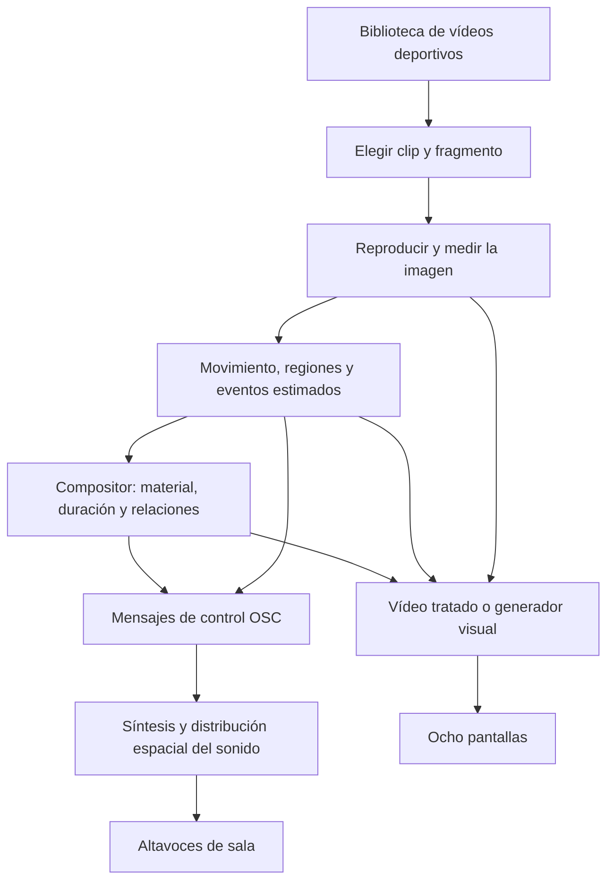

# Cómo funciona Partitura del Juego

Esta guía explica la obra desde la experiencia del público hasta las reglas que
la producen. No hace falta saber programar ni leer música. Para montar y operar
la instalación, consultar el [manual](MANUAL_ES.md).

**Alcance:** los apartados 1–9 describen la base de ocho canales publicada en
GitHub. Las ampliaciones de la copia de trabajo del 22 de septiembre de 2026
—forma de siete secciones, detección de personas, caché de análisis, paletas y
visor sonoro— se explican por separado en
[La edición de trabajo](EDICION_DE_TRABAJO_ES.md). Su documentación no implica
que estén incluidas en el código público o en un paquete descargado anterior.

## 1. Qué significa «partitura» en esta obra

Una partitura organiza materiales en el tiempo: indica qué aparece, cuánto
dura, cómo cambia y cómo se relaciona con lo demás. Aquí esos materiales son
vídeos deportivos, puntos, líneas, números, pulsos, ruido y sonidos sostenidos.
La partitura está escrita como reglas que el ordenador interpreta durante la
función. El resultado audiovisual se construye mientras lo vemos y escuchamos.

El vídeo aporta un acontecimiento ya registrado. El programa mide cambios de
imagen y movimiento; después utiliza esas medidas dentro de una composición.
Por eso una carrera puede alimentar una textura, una distribución de cuerpos
puede desplazar el sonido y varias pantallas pueden reunirse en un mismo pulso.
Las relaciones dependen del material y del estado compositivo activo.

Conviene distinguir tres usos de la palabra:

| Nombre | Qué significa |
|---|---|
| Partitura de la instalación | Las reglas de duración, contraste, coordinación y transformación del conjunto. |
| Partitura gráfica (`GraphicScore`) | Los tratamientos que convierten un vídeo en líneas, cifras, cajas, barras o imagen procesada. |
| Partitura sonora visible | Un visor de actividad de audio de la edición de trabajo; se explica en el documento complementario. |

**Generativo** significa que las reglas producen variaciones durante la
ejecución. **Reactivo** significa que algunas de esas variaciones responden a
datos del vídeo. La obra combina ambas cosas: tiene organización propia y
también escucha, mediante mediciones, lo que sucede en las imágenes.

## 2. El recorrido completo



Los pasos del dibujo se repiten continuamente y se solapan. El análisis puede
trabajar sobre una imagen reducida mientras la tarjeta gráfica dibuja la salida.
El motor sonoro recibe números de control; OSC no transporta aquí el vídeo ni
la señal de audio. SuperCollider produce el sonido a partir de esos controles.

Un **canal** es una parte de la composición con su propio estado. Hay ocho
canales visuales, numerados internamente de 0 a 7. Comparten directores y reloj,
pero pueden mostrar materiales distintos. Las ventanas A y B agrupan cuatro
canales cada una y los controladores de vídeo los distribuyen a las pantallas.
Un canal visual tampoco equivale a un altavoz: su sonido puede repartirse por
varias salidas de audio.

## 3. Cómo se elige el vídeo

La biblioteca separa clips verticales y horizontales. `ClipPool` intenta elegir
un vídeo que no esté siendo usado por otro canal del mismo grupo y que ese
canal no haya reproducido recientemente. Si quedan muy pocos candidatos,
relaja restricciones para poder continuar.

`VideoDirector` decide cómo recorrer el clip:

| Plan | Qué hace | Efecto compositivo |
|---|---|---|
| Fragmento corto | Elige un tramo breve dentro del clip. | Introduce cortes y cambios de atención. |
| Fragmento largo | Mantiene el material durante más tiempo. | Permite reconocer y seguir un movimiento. |
| Vídeo completo | Recorre el clip completo. | Conserva un arco temporal más largo. |

Los pesos de los planes y los rangos de duración son configurables. Un peso es
una preferencia de selección, no una obligación de ocupar ese porcentaje del
tiempo total. Un fragmento largo puede ocupar más tiempo aunque se elija menos.

También existen acontecimientos compartidos: el director prepara los canales
participantes, espera su disponibilidad y utiliza una referencia temporal
común. Esa coordinación se distingue de que dos pantallas coincidan por azar.
Los grupos pueden seguir teniendo bibliotecas de orientación distinta.

## 4. Qué se mide y qué significan los datos

La visión por ordenador transforma imágenes en medidas. En la base publicada,
las regiones detectadas son **blobs**: manchas de primer plano que pueden
corresponder a cuerpos, sombras, fragmentos de un cuerpo u otros cambios. Una
etiqueta de seguimiento enlaza una región entre imágenes próximas; no identifica
a un deportista por su nombre ni garantiza reconocerlo tras un corte de cámara.

### 4.1 Preparar la imagen

El análisis utiliza una copia reducida, la convierte a gris y puede mejorar su
contraste. El detalle destinado a la pantalla sigue una ruta de dibujo propia.
Reducir la imagen ahorra trabajo, pero también hace menos visibles objetos
pequeños. La resolución efectiva depende de la configuración y de las etapas de
reducción; no debe confundirse con la resolución física de la pantalla.

### 4.2 Energía de movimiento: cuánto ha cambiado

El programa resta dos imágenes consecutivas, toma el valor absoluto de cada
diferencia y calcula su media:

```text
energía = media(|gris_actual − gris_anterior|) / 255
```

El resultado se sitúa entre 0 y 1. Por ejemplo, una diferencia media de 12,75
niveles de gris produce 0,05. Esto mide cambio de imagen: un paneo de cámara,
un corte de montaje o una variación de luz también pueden aumentarlo. No es
una medida de esfuerzo físico ni de velocidad deportiva.

### 4.3 Flujo óptico: hacia dónde parece moverse la imagen

Farneback estima pequeños desplazamientos entre imágenes. El código obtiene
el vector medio del campo y calcula su longitud y su ángulo:

```text
vector_medio = promedio de los vectores de desplazamiento
magnitud = longitud(vector_medio)
dirección = atan2(vector_medio.y, vector_medio.x)
```

Es la **longitud del vector medio**, no la media de todas las longitudes. Si
media imagen se mueve a la derecha y la otra mitad a la izquierda, los vectores
pueden cancelarse y dar una magnitud pequeña aunque haya mucho movimiento.
Por eso flujo y energía son medidas complementarias. El flujo no está expresado
en metros por segundo y depende del tamaño y del intervalo de las imágenes.

### 4.4 Fondo, contornos y seguimiento

MOG2 mantiene un modelo estadístico del aspecto habitual de cada zona de la
imagen. Marca como primer plano lo que se separa de ese modelo. El buscador de
contornos agrupa regiones y calcula posición, área y caja envolvente. El
seguimiento relaciona detecciones próximas entre fotogramas.

Las posiciones se normalizan: `(0, 0)` corresponde al extremo superior
izquierdo y `(1, 1)` al inferior derecho de la imagen de análisis. Así pueden
utilizarse sin depender directamente del número de píxeles del monitor. El
área de los blobs, en cambio, se maneja en píxeles del análisis; no es un área
real sobre la cancha.

Canny extrae bordes a partir de cambios de intensidad. Un borde no es
necesariamente el contorno de una persona: también puede ser una línea de
campo, una letra o una grada. Los tratamientos gráficos utilizan estas
estructuras como material visual.

### 4.5 Eventos: hipótesis útiles para componer

| Dato | Regla de la base publicada | Cómo interpretarlo |
|---|---|---|
| `collision` | Solapamiento de cajas o caída brusca del número de blobs. | Posible encuentro o fusión visual; no confirma contacto físico. |
| `ballDetected` | Región pequeña cuya velocidad supera un umbral. | Candidato a balón; otros objetos pueden cumplir la regla. |
| `crowdDensity` | Busca el mayor grupo de regiones próximas y normaliza su tamaño. | Concentración en la imagen; no un recuento exacto del público. |
| `legDistance` | Calcula una proporción de altura y área de las regiones. | Proxy de elongación; el nombre no significa que mida la distancia entre piernas. |

El solapamiento usa IoU: área de intersección de dos cajas dividida entre el
área de su unión. Las reglas convierten mediciones en señales compositivas,
pero la obra no arbitra el partido ni reconoce su resultado.

## 5. Cómo las medidas se convierten en decisiones

### 5.1 Quién decide cada cosa

| Componente | Pregunta que resuelve |
|---|---|
| `ClipPool` | ¿Qué clips están disponibles y cuáles conviene evitar repetir? |
| `VideoDirector` | ¿Qué fragmento se reproduce y cuándo empieza o termina? |
| `VisualComposer` | ¿Qué material presenta cada canal y cómo se relaciona con los demás? |
| `GraphicScore` | ¿Cómo se transforma gráficamente el vídeo? |
| `GlobalDirector` | ¿Se ralentiza, acelera o cubre temporalmente el conjunto? |
| Motor SuperCollider | ¿Con qué voz, articulación y posición se interpreta el estado recibido? |

### 5.2 Contenidos y capítulos

El compositor elige entre vídeo, generador, respiración y transición. Un
**generador** dibuja un material mediante reglas —por ejemplo, una matriz de
puntos— en lugar de mostrar directamente el fotograma. Puede incorporar datos
del análisis. Una **respiración** reduce la actividad; no garantiza silencio
absoluto, porque puede persistir una voz o una cola de efecto.

Cada capítulo tiene una duración y un recorrido: aparición, desarrollo,
umbral, transformación y disolución. Una envolvente regula cuánto se hace
presente. Una permanencia mínima impide que una lectura momentánea interrumpa
constantemente la composición. En un capítulo de vídeo también interviene la
notificación de que el fragmento ha terminado.

### 5.3 Azar con memoria

Las opciones se sortean con pesos. Antes del sorteo se aplican restricciones:
materiales deshabilitados, historia reciente, vecinos y disponibilidad de vídeo.
El sistema puede reducir el peso de repetir el contenido actual y favorecer
familias acordes con el movimiento colectivo. Si faltan candidatos, relaja
algunas restricciones.

Por ejemplo, pesos `45, 35, 12, 8` repartirían un sorteo sin restricciones en
45 % vídeo, 35 % generador, 12 % respiración y 8 % transición. El programa real
modifica los candidatos antes de decidir; esos números no predicen por sí solos
lo que ocupará cada pantalla.

La semilla inicial organiza parte del azar del compositor. Repetir una semilla
no equivale a reproducir una grabación idéntica: también influyen el vídeo,
los tiempos de carga, la intervención manual y otros sorteos del programa.

### 5.4 Cómo dialogan las ocho pantallas

| Organización | Relación entre canales | Lectura para el público |
|---|---|---|
| Unísono | Comparte una decisión de material. | El conjunto actúa como una sola figura. |
| Propagación | Introduce desfases y relaciones entre canales. | Una acción parece recorrer la instalación. |
| Contrapunto | Permite estados diferenciados por canal. | Coexisten varias líneas de atención. |
| Grupos 4+4 | Organiza dos conjuntos de cuatro. | Dos bloques pueden responderse o contrastar. |

Son reglas de relación, no necesariamente ocho copias idénticas de píxeles o
sonido. El rol de cada pantalla puede cambiar la interpretación del material.

En la base publicada hay momentos de pulso común (`PulseSystem`), barrido
común (`BarScanSystem`) e intercalación. Durante la intercalación conviven
vídeo y generadores; pueden aparecer ocupaciones temporales de todo el muro,
ruido o inversiones de imagen según la configuración.

### 5.5 Movimiento colectivo

El compositor resume lo que ocurre entre canales: actividad, población de
regiones, coherencia direccional, diversidad de materiales, convergencia y
tensión. Son índices construidos por el programa, no estados psicológicos.

Con ellos propone estados como suspensión, codificación, acumulación,
propagación, convergencia, fragmentación, saturación, ruptura y residuo. Las
reglas también consideran el material visible; una pantalla llena de ruido
puede contribuir a saturación aunque el vídeo de fondo tenga poca actividad.

El candidato debe sostenerse durante un tiempo y el estado vigente tiene una
permanencia protegida. Los eventos tienen además tiempos de espera. Los
estados urgentes pueden usar una espera menor y saltarse la permanencia habitual.
Este mecanismo evita saltar de estado ante cada fluctuación y permite reconocer
frases en lugar de una sucesión de reacciones aisladas.

## 6. Cómo se construye la imagen

Hay tres familias de trabajo visual:

| Familia | Operación | Ejemplos |
|---|---|---|
| Vídeo transformado | Reinterpreta brillo, movimiento y regiones del fotograma. | Cifras en `VideoNumbers`, líneas en `VideoLines`, cajas en `BBoxTracker`. |
| Generadores procedimentales | Dibuja estructuras mediante reglas y parámetros. | `BitMatrix`, `PhaseLines`, `Pulse`, `BarScan`, `GranularRaster`. |
| Nube de puntos de vídeo | Muestrea la imagen en una rejilla y coloca esos puntos en un espacio con profundidad. | Relieve de luminancia, máscaras o profundidad PDJV cuando están disponibles. |

En `VideoNumbers`, por ejemplo, el brillo de cada celda se convierte en una
cifra. En `Waveform` se muestra un historial de energía de movimiento: no es
el dibujo de la onda sonora. En `Barcode`, barras resumen la ocupación de
primer plano por columnas. Esas traducciones hacen visibles ciertas medidas
y omiten otras.

La nube de puntos puede desplazar los puntos en profundidad usando su brillo.
Eso produce un relieve de la imagen, no una medición tridimensional del campo.
Las rutas que leen profundidad PDJV dependen de los datos que contenga el
paquete; la apariencia volumétrica por sí sola no demuestra exactitud física.
Del mismo modo, «térmico» nombra un tratamiento de intensidad y color: el vídeo
no procede de una cámara que mida temperatura.

La base pública recorre una secuencia gráfica fija con pausas `BwClean`.
La edición de trabajo utiliza una bolsa de modos barajada y restringida por
la sección activa. `SlitScan`, que acumula columnas de distintos instantes,
queda fuera de la secuencia automática en ambas rutas.

## 7. Cómo se construye el sonido

El modo visual o el generador selecciona un perfil sonoro. El motor combina
voces sostenidas, pulsos, ruido, subgraves, acentos y efectos según ese perfil
y el estado recibido. Los datos del vídeo modulan esa identidad: no existe
una única regla universal «un jugador = una nota».

| Control | Papel en la interpretación sonora |
|---|---|
| Modo, generador y etapa temporal | Seleccionan y articulan una familia sonora. |
| Energía, flujo y geometría agregada | Modulan actividad, textura y parámetros espaciales dentro del perfil. |
| Reloj y organización compartidos | Proporcionan referencias para coordinar entradas, pulsos y relaciones. |
| Eventos estimados | Pueden producir acentos, sujetos a reglas de disparo. |
| Respiración, disolución y clear global | Reducen presencia o introducen separaciones. Las colas no siempre desaparecen de inmediato. |

### 7.1 OSC como vocabulario de control

`OSCSender` publica mensajes con dirección y valores. Por ejemplo,
`/pdj/channel/0/motion/energy` informa de una medida del canal 0;
`/pdj/clock/state` comunica el reloj común y `/pdj/collective/state` resume el
estado colectivo. SuperCollider recibe normalmente en UDP 9001.

El envío incluye hasta ocho huecos de blobs por canal y vacía los no usados.
Así una detección que desaparece no queda indefinidamente activa en el receptor.
Las revisiones distinguen cambios de capítulo de actualizaciones de sus
parámetros. El reloj compartido es una referencia musical; el transporte UDP
no garantiza por sí mismo sincronización exacta con cada fotograma.

### 7.2 Espacialización: de la imagen a la sala

El motor obtiene posiciones de fuentes a partir de la geometría recibida y
del contexto compositivo. DBAP reparte una fuente entre altavoces según la
distancia a sus posiciones configuradas. Conceptualmente:

```text
distancia_i = máximo(distancia entre fuente y altavoz_i, 0,001)
peso_i = distancia_i ^ (−rolloff) + spread × 0,5
ganancia_i = peso_i / raíz(media de los pesos al cuadrado)
```

`rolloff` controla cuánto pesa la cercanía y `spread` añade una contribución
común. La fórmula refleja la normalización RMS de esta implementación; no
significa que todas las ganancias sumen 1. Las ganancias afectan a la mezcla,
cuya salida también depende de niveles y efectos.

En DANTE se utilizan ocho salidas físicas. La ruta estéreo reduce la experiencia
a izquierda y derecha mediante panoramización; sirve para escuchar el sistema,
pero no reproduce el espacio de ocho altavoces.

## 8. Un ejemplo, paso a paso

Este recorrido es ilustrativo, no una secuencia obligatoria:

1. Un canal recibe un fragmento deportivo. Aparece una imagen con varias
   regiones en movimiento.
2. El análisis detecta cambio de brillo, un desplazamiento dominante y posiciones
   aproximadas. Si la cámara panea, parte de esos datos procederá de la cámara.
3. Un tratamiento puede dibujar cifras o líneas, mientras otros canales muestran
   generadores con su propia duración y fase.
4. El motor sonoro mantiene el perfil de cada material y modifica parámetros
   con las medidas disponibles. La posición agregada puede mover una fuente.
5. Si una tendencia colectiva persiste, el compositor puede cambiar la relación
   entre canales o favorecer otra familia en la siguiente elección.
6. Al terminar capítulos y fragmentos, aparecen materiales nuevos, pausas o
   transiciones. La memoria reciente favorece variación sin borrar la gramática.

Para observarlo en sala, seguir primero una pantalla: reconocer su material,
su duración y su retirada. Después ampliar la atención al conjunto: comprobar
si otras pantallas acompañan, responden o mantienen una actividad diferente.

## 9. Dónde continuar

| Quiero entender… | Lectura o código de referencia |
|---|---|
| Instalación, arranque y controles | [Manual de instalación y operación](MANUAL_ES.md) |
| Las ampliaciones de septiembre de 2026 | [La edición de trabajo](EDICION_DE_TRABAJO_ES.md) |
| Configuración de audio de sala | [Audio multicanal](AUDIO_MULTICHANNEL_ES.md) |
| Elección de vídeo | [`ClipPool.cpp`](../src/ClipPool.cpp), [`VideoDirector.cpp`](../src/VideoDirector.cpp) |
| Medidas de imagen y eventos | [`CVPipeline.cpp`](../src/CVPipeline.cpp), [`EventDetector.cpp`](../src/EventDetector.cpp) |
| Reglas compositivas | [`VisualComposer.cpp`](../src/VisualComposer.cpp), [`GlobalDirector.cpp`](../src/GlobalDirector.cpp) |
| Tratamientos y generadores | [`GraphicScore.cpp`](../src/GraphicScore.cpp), [`VisualGenerator.cpp`](../src/VisualGenerator.cpp) |
| Relieve de vídeo | [`VideoPointCloudGenerator.cpp`](../src/VideoPointCloudGenerator.cpp) |
| Comunicación y síntesis | [`OSCSender.cpp`](../src/OSCSender.cpp), [`pdj_datamatics.scd`](../supercollider/pdj_datamatics.scd) |
| Paquetes volumétricos independientes | [Formato PDJV](pdjv/PDJV_FORMAT.md), [analyzer](../analyzer/README.md), [runtime volumétrico](../volumetric/README.md) |

Los valores de configuración son parte de la interpretación. Los ajustes
guardados por el operador pueden prevalecer sobre los incluidos en el paquete;
por eso una captura, una sesión local y otra instalación pueden mostrar
duraciones, colores o distribuciones diferentes sin dejar de utilizar el mismo
principio compositivo.
