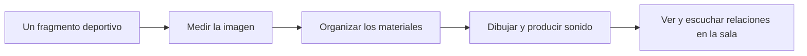

# Cómo funciona Partitura del Juego

Esta guía acompaña la visita a la instalación y el trabajo educativo del museo.
Se puede leer antes de entrar, consultar después de la experiencia o utilizar
como apoyo para una conversación. No requiere saber programar ni leer música.

## Una partitura que se ve y se escucha

En una partitura musical, unas indicaciones organizan sonidos en el tiempo.
En *Partitura del Juego*, las indicaciones organizan también imágenes: cuándo
aparece un cuerpo, cuánto permanece una textura, cómo recorre un pulso las
pantallas o en qué momento el conjunto deja un espacio vacío.

La obra utiliza vídeos deportivos pregrabados. El ordenador mide cambios y
movimiento en las imágenes y los transforma en líneas, cifras, puntos y
sonidos. A la vez, sigue reglas compositivas que ordenan esas transformaciones.
Cada ejecución combina organización, datos del vídeo y selecciones variables.

El título permite pensar el juego como partido, movimiento y acto de reproducir.
Los cuerpos filmados se convierten en materia de una composición que excede
el acontecimiento deportivo.

## Del vídeo a la sala

Primero se elige un clip y un tramo de reproducción. El análisis aporta cambios
de brillo, desplazamientos y posiciones estimadas. La composición decide qué
material presenta cada pantalla y durante cuánto tiempo. El programa visual
dibuja las imágenes y comunica datos al motor de sonido, que produce y
distribuye el audio entre las salidas de la sala.

Parte del análisis se prepara con antelación y se consulta siguiendo el tiempo
del vídeo. La composición y el dibujo se desarrollan durante la ejecución.

## Qué puede observar el ordenador

Podemos mirar un partido y reconocer intenciones, reglas o nombres. El sistema
trabaja con información más acotada:

| Pregunta del análisis | Qué obtiene | Qué conviene recordar |
|---|---|---|
| ¿Cuánto cambia la imagen? | Una medida de diferencia entre imágenes. | Un corte o un cambio de luz también cuentan. |
| ¿Hacia dónde parece desplazarse? | Una estimación de movimiento. | El movimiento de la cámara influye en el resultado. |
| ¿Dónde hay personas sobre la superficie de juego? | Cajas de localización y etiquetas temporales. | Una etiqueta sigue una detección; no nombra a una persona. |
| ¿Cómo se distribuyen las detecciones? | Proximidades, agrupaciones y trayectorias. | Son relaciones de imagen, no distancias medidas sobre la cancha. |

La detección de personas necesita un modelo y evidencia de superficie de juego.
Si falta esa evidencia, las marcas pueden desaparecer. Su ausencia no demuestra
que no haya personas: también expresa límites de la observación.

«Colisión» y «balón» son hipótesis basadas en geometría, tamaño, movimiento y
continuidad. La obra no decide si hay una falta ni lleva el marcador del partido.

## Tres maneras de construir una imagen

**Transformar el vídeo.** Una cuadrícula traduce brillo a números; los bordes
se convierten en líneas; las detecciones se marcan con cajas. El vídeo aporta
una estructura que el tratamiento permite mirar de otra manera.

**Dibujar con reglas.** Los generadores producen matrices, barridos, pulsos,
campos de líneas y ruido. Sus parámetros cambian con la composición y pueden
recibir medidas del análisis. Una imagen geométrica participa de la partitura
aunque no permita reconocer el deporte de origen.

**Construir un relieve de puntos.** El programa toma muestras del vídeo y las
sitúa en una nube de puntos. El brillo puede determinar su profundidad. La
sensación de volumen es una transformación visual; no constituye por sí misma
una medición tridimensional del cuerpo o del campo.

El tratamiento «térmico» utiliza intensidad y color; no mide temperatura.
`Waveform` representa un historial de cambio visual, no la onda sonora.

## Cómo se organiza el tiempo

Un pulso es un acontecimiento breve. Un capítulo permite que un material
aparezca, se desarrolle, se transforme y se retire de una pantalla. Una sección
organiza un tramo más largo del conjunto.

| Sección | Una forma de escucharla y observarla |
|---|---|
| Calibración | Atender a lo escaso, lento y contenido. |
| Codificación | Reconocer unidades, cuadrículas y repeticiones. |
| Acumulación | Percibir cómo aumenta la actividad. |
| Expansión dimensional | Seguir relaciones de espacio y superposición. |
| Saturación | Observar concentración, densidad y presión. |
| Ruptura | Reconocer una interrupción o puntuación colectiva. |
| Recursión | Encontrar retornos y reorganizaciones del material. |

La tabla ofrece claves de atención, no un recorrido obligatorio ni una respuesta
emocional. El orden se elige mediante reglas de contraste y memoria. Una cesura
separa secciones mediante colapso, vacío y emergencia. La retirada y la
respiración también componen.

La variación no implica que cualquier cosa ocurra en cualquier momento. Cada
sección limita materiales, duraciones y comportamientos. El sistema recuerda
elecciones recientes y favorece otras posibilidades.

## Ocho pantallas que se relacionan

Cada pantalla corresponde a un canal. Los canales comparten información y reloj,
pero pueden presentar contenidos diferentes.

| Relación | Qué buscar durante la visita |
|---|---|
| Unísono | Varios canales actúan juntos y el conjunto se percibe como una figura. |
| Propagación | Una acción parece pasar de una zona a otra. |
| Contrapunto | Diferentes actividades conviven y se responden. |
| Dos grupos de cuatro | Dos bloques establecen similitudes o contrastes. |

El programa resume la actividad de las imágenes y la diversidad del material
visible. Si una tendencia persiste, puede favorecer una relación o una familia
de materiales. Mantener decisiones durante un tiempo permite percibir frases
en lugar de respuestas a cada pequeña fluctuación.

## Cómo se relacionan imagen y sonido

Los materiales visuales tienen perfiles de interpretación sonora. El motor
combina voces sostenidas, pulsos, texturas de ruido, subgraves y acentos.
Las medidas del vídeo modulan parámetros dentro de esos perfiles; el estado
compositivo organiza su duración y relación.

No hay una correspondencia universal entre un cuerpo y una nota. Una medida
puede intervenir en una textura o en un desplazamiento espacial, según el
contexto. La relación se construye mediante varias reglas.

Monochrome, Ember, Glacier, Verdant e Iris organizan el color y participan en
el tratamiento sonoro. El nombre de una paleta no impone una emoción; la
interpretación también depende de cada visitante.

En el montaje multicanal, una fuente se reparte entre varias salidas de audio.
Nuestra posición modifica la relación con esas fuentes. Una pantalla no
representa un altavoz exclusivo.

## Leer la franja sonora

En la parte inferior de cada canal hay tres filas: **sonido**, **pulsos** y
**textura**. La derecha señala **AHORA**; hacia la izquierda quedan seis
segundos de historia.

| Marca | Lectura |
|---|---|
| Punto o marca breve en pulsos | Actividad breve informada por el motor de audio. |
| Trazo en sonido | Continuidad de la voz medida. |
| Trazo grueso en textura | Actividad de la capa de ruido medida. |
| Espacio sin marca | No hay actividad representada de esa capa en ese tramo. |

La franja representa tres capas instrumentadas. Otras contribuciones y efectos
pueden escucharse sin una marca propia. Un espacio vacío no certifica silencio
en toda la sala. Si faltan datos recientes, el presente no permite afirmar que
haya silencio. La [guía de la franja](PARTITURA_SONORA_ES.md) detalla su alcance.

## Un recorrido posible de atención

1. Elegir una pantalla y describir su material sin intentar nombrar el algoritmo.
2. Seguir su entrada, permanencia, transformación y retirada.
3. Escuchar si se reconoce una relación temporal con alguna actividad sonora.
4. Ampliar la mirada y buscar coincidencias, respuestas o contrastes.
5. Cambiar de posición, si es posible, y comparar la experiencia espacial.

Es útil distinguir observación —«aparecen marcas repetidas»—, interpretación
—«me recuerdan una carrera»— e hipótesis —«quizá el sonido responde a ese
movimiento»—. No hace falta encontrar una única relación correcta.

La [guía de mediación](MEDIACION_MUSEOS_ES.md) propone actividades para trabajar
estas diferencias. [Algoritmos y procesos](ALGORITMOS_Y_PROCESOS_ES.md) explica
cómo se calculan y utilizan los datos.
